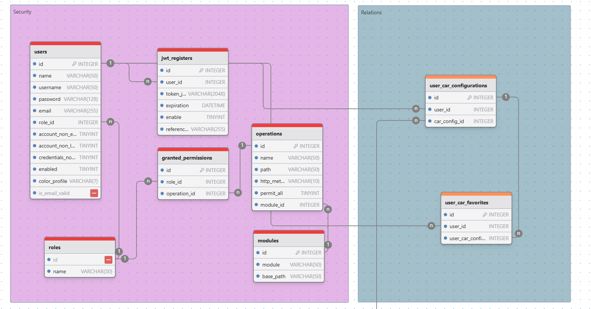
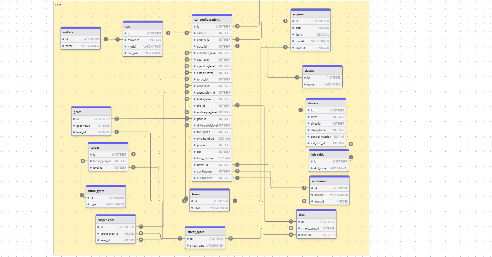
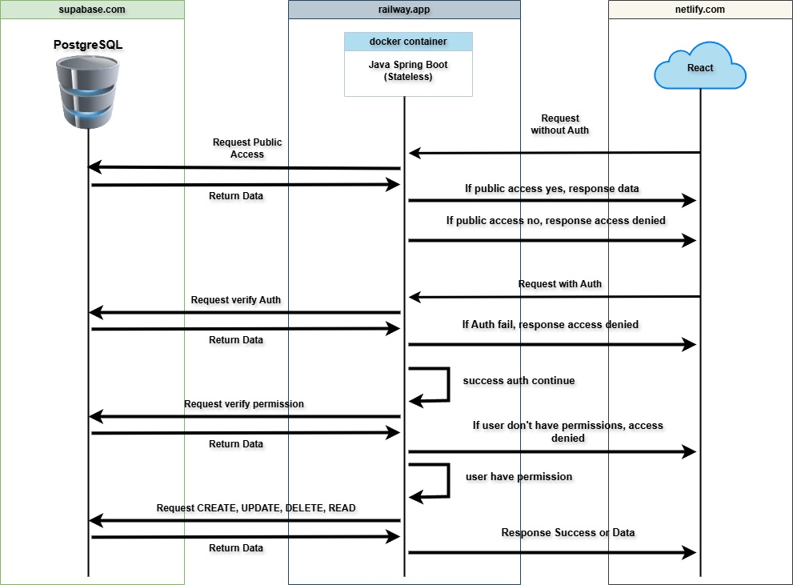

# sdd-database-desing

## Project: SDD-Catalog

Currently, video game enthusiasts, particularly players of [**Need for Speed Unbound**](https://www.ea.com/es-es/games/need-for-speed/need-for-speed-unbound), lack a centralized platform where they can create, save, and share personalized configurations for their vehicles. This includes specific features such as the engine, suspension, wheels, and other modifications that are part of their game strategies.

Players often rely on unorganized notes or screenshots, making it challenging to manage and share ideas with other users.

---

## Proposed Solution

We propose developing a web application called [**SDD-Catalog**](https://sdd-catalog.netlify.app/home), which will allow users to:

### 1. Manage Vehicle Configurations  
Users will be able to create, save, and update configurations for their vehicles, defining technical aspects like the engine, suspension, turbo, and more. These configurations will be accessible for consultation at any time.

### 2. Explore Other Users' Configurations  
A gallery will be available where users can browse and explore configurations shared by other players, fostering collaborative learning and inspiration.

### 3. Authentication and Security  
Users will have personal accounts secured with robust authentication to ensure only they can manage their configurations.

### 4. User Interaction  
The platform will include a feature to contact the administrator and eventually communicate with other users, fostering a collaborative community.

---

## Main Objective 

Provide a practical, accessible, and secure tool that facilitates the creation, management, and collaboration among [**Need for Speed Unbound**](https://www.ea.com/es-es/games/need-for-speed/need-for-speed-unbound) players, enhancing the gaming experience and fostering an active community.

## Proyecto: SDD-Catalog

Actualmente, los entusiastas de los videojuegos, en particular los jugadores de [**Need for Speed Unbound**](https://www.ea.com/es-es/games/need-for-speed/need-for-speed-unbound), carecen de una plataforma centralizada donde puedan crear, guardar, y compartir configuraciones personalizadas de sus vehículos. Esto incluye características específicas como el motor, la suspensión, las ruedas, y otras modificaciones que forman parte de sus estrategias de juego.

Por lo general, los jugadores recurren a notas desorganizadas o capturas de pantalla, lo que dificulta la gestión y el intercambio de ideas con otros usuarios.

---

## Propuesta de Solución

Se propone desarrollar una aplicación web llamada [**SDD-Catalog**](https://sdd-catalog.netlify.app/home), que permita a los usuarios:

### 1. Gestionar Configuraciones de Vehículos  
Los usuarios podrán crear, guardar y actualizar configuraciones de sus vehículos, definiendo aspectos técnicos como motor, suspensión, turbo, entre otros. Estas configuraciones estarán disponibles para consulta en cualquier momento.

### 2. Explorar Configuraciones de Otros Usuarios  
Se habilitará una galería donde los usuarios podrán navegar y explorar las configuraciones compartidas por otros jugadores, fomentando el aprendizaje colaborativo y la inspiración.

### 3. Autenticación y Seguridad  
Los usuarios tendrán cuentas personales protegidas por autenticación segura para garantizar que solo ellos puedan gestionar sus configuraciones.

### 4. Interacción entre Usuarios  
La plataforma incluirá una función para contactar al administrador y eventualmente comunicarse con otros usuarios, creando una comunidad colaborativa.

---

## Objetivo Principal

Proveer una herramienta práctica, accesible y segura que facilite la creación, gestión y colaboración entre jugadores de [**Need for Speed Unbound**](https://www.ea.com/es-es/games/need-for-speed/need-for-speed-unbound), mejorando la experiencia del juego y fomentando una comunidad activa.

---

## Summary

- [Introduction](#introduction)
- [Database Type](#database-type)
- [Table Structure](#table-structure)
    - [modules](#modules)
    - [operations](#operations)
    - [roles](#roles)
    - [granted_permissions](#granted_permissions)
    - [users](#users)
    - [jwt_registers](#jwt_registers)
    - [init_skids](#init_skids)
    - [street_types](#street_types)
    - [classes](#classes)
    - [turbo_types](#turbo_types)
    - [makers](#makers)
    - [levels](#levels)
    - [cars](#cars)
    - [drivers](#drivers)
    - [tires](#tires)
    - [suspensions](#suspensions)
    - [turbos](#turbos)
    - [gears](#gears)
    - [engines](#engines)
    - [auxiliaries](#auxiliaries)
    - [car_configurations](#car_configurations)
    - [user_car_configurations](#user_car_configurations)
    - [user_car_favorites](#user_car_favorites)
- [Relationships](#relationships)
- [Database Diagram](#database-Diagram)

## Introduction

The database for [**SDD-Catalog**](https://sdd-catalog.netlify.app/home) has been designed to efficiently address key aspects of the application, including security, vehicle configuration management, and user interaction. The design focuses on three main areas:

1. **User Authentication and Management Security:**  
   A robust system has been implemented to store and manage user information, ensuring that only authenticated users can access their configurations and data. Password security is handled through encryption techniques and token-based authentication, protecting sensitive data privacy.

2. **Vehicle Configuration Storage:**  
   The database allows storing personalized vehicle configurations, including attributes such as engine, suspension, turbo, and other key details for each vehicle. Each configuration is linked to a user, and can be saved, modified, or deleted as needed.

3. **User and Admin Interaction:**  
   In addition to storing configurations, the database supports user and admin interaction on the platform. This includes tracking messages sent by users and managing requests and inquiries.

The database design is focused on scalability, allowing for the addition of more features and functionalities in the future without compromising performance or security.

---

La base de datos para [**SDD-Catalog**](https://sdd-catalog.netlify.app/home) ha sido diseñada para abordar de manera eficiente los aspectos clave de la aplicación, incluyendo la seguridad, la gestión de configuraciones de vehículos y la interacción entre los usuarios. El diseño se centra en tres áreas principales:

1. **Seguridad en la Autenticación y Gestión de Usuarios:**  
   Se ha implementado un sistema robusto para almacenar y gestionar la información de los usuarios, asegurando que solo los usuarios autenticados puedan acceder a sus configuraciones y datos. La seguridad de las contraseñas se maneja a través de técnicas de cifrado y autenticación de tokens, protegiendo la privacidad de los datos sensibles.

2. **Almacenamiento de Configuraciones de Vehículos:**  
   La base de datos permite almacenar configuraciones personalizadas de vehículos, que incluyen atributos como motor, suspensión, turbo, y otros detalles clave de cada vehículo. Cada configuración está asociada con un usuario y se puede guardar, modificar o eliminar según sea necesario.

3. **Interacción entre Usuarios y Administración:**  
   Además del almacenamiento de configuraciones, la base de datos soporta la interacción entre los usuarios y el administrador de la plataforma. Esto incluye el seguimiento de los mensajes enviados por los usuarios y la administración de solicitudes y consultas.

El diseño de la base de datos se ha realizado con un enfoque de escalabilidad, permitiendo agregar más funcionalidades y características en el futuro sin comprometer el rendimiento ni la seguridad de la aplicación.

## Database type

- **Database system:** PostgreSQL
## Table structure

### modules

| Name        | Type          | Settings                      | References                    | Note                           |
|-------------|---------------|-------------------------------|-------------------------------|--------------------------------|
| **id** | INTEGER | 🔑 PK, not null , unique, autoincrement |  | |
| **module** | VARCHAR(50) | not null  |  | |
| **base_path** | VARCHAR(50) | not null  |  | | 

#### **Purpose**:
The `modules` table is designed to store information about different application modules, each of which corresponds to a group of related endpoints. The table helps in organizing and structuring the API endpoints by associating each with a specific base path, making it easier to manage and maintain the routing of requests.

#### **Fields**:
- **id**: 
  - **Type**: INTEGER 
  - **Description**: A unique identifier for each module (Primary Key).
  - **Constraints**: Not null, unique, auto-increment.
  
- **module**: 
  - **Type**: VARCHAR(50)
  - **Description**: The name of the module (e.g., `user`, `product`, `auth`).
  - **Constraints**: Not null.
  
- **base_path**: 
  - **Type**: VARCHAR(50)
  - **Description**: The base path of the module, used as a prefix for all endpoints within that module (e.g., `/api/users`, `/api/products`).
  - **Constraints**: Not null.

#### **References**:
- No external references (foreign keys) in this table.

#### **Notes**:
This table plays a crucial role in organizing the API by categorizing it into different modules. Each module corresponds to a specific functionality within the application, and the base path defines the route prefix for all the endpoints under that module. This design allows for easier scalability and management of API routes as the application grows.

---

### **Tabla modules**

#### **Propósito**:
La tabla `modules` está diseñada para almacenar información sobre los diferentes módulos de la aplicación, cada uno de los cuales corresponde a un grupo de endpoints relacionados. La tabla ayuda a organizar y estructurar los endpoints de la API, asociando cada uno con una ruta base específica, lo que facilita la gestión y el mantenimiento de las rutas de las solicitudes.

#### **Campos**:
- **id**: 
  - **Tipo**: INTEGER 
  - **Descripción**: Un identificador único para cada módulo (Clave primaria).
  - **Restricciones**: No nulo, único, autoincrementable.
  
- **module**: 
  - **Tipo**: VARCHAR(50)
  - **Descripción**: El nombre del módulo (por ejemplo, `user`, `product`, `auth`).
  - **Restricciones**: No nulo.
  
- **base_path**: 
  - **Tipo**: VARCHAR(50)
  - **Descripción**: La ruta base del módulo, utilizada como prefijo para todos los endpoints dentro de ese módulo (por ejemplo, `/api/users`, `/api/products`).
  - **Restricciones**: No nulo.

#### **Referencias**:
- No hay referencias externas (claves foráneas) en esta tabla.

#### **Notas**:
Esta tabla desempeña un papel crucial en la organización de la API al categorizarla en diferentes módulos. Cada módulo corresponde a una funcionalidad específica dentro de la aplicación, y la ruta base define el prefijo de ruta para todos los endpoints bajo ese módulo. Este diseño permite una escalabilidad y gestión más fáciles de las rutas de la API a medida que la aplicación crece.

---

### operations

| Name        | Type          | Settings                      | References                    | Note                           |
|-------------|---------------|-------------------------------|-------------------------------|--------------------------------|
| **id** | INTEGER | 🔑 PK, not null , unique, autoincrement | operations_id_fk | |
| **name** | VARCHAR(50) | not null  |  | |
| **path** | VARCHAR(50) | not null  |  | |
| **http_method** | VARCHAR(10) | not null  |  | |
| **permit_all** | TINYINT | not null , default: 0 |  | |
| **module_id** | INTEGER | not null  | operations_module_id_fk | | 

### **operations Table**

#### **Purpose**:
The `operations` table is designed to store information about the different operations (or actions) within the application's API. Each operation represents a specific endpoint with its associated HTTP method and path. The table also tracks whether the operation is publicly accessible (`permit_all`) and associates each operation with a module.

#### **Fields**:
- **id**: 
  - **Type**: INTEGER 
  - **Description**: A unique identifier for each operation (Primary Key).
  - **Constraints**: Not null, unique, auto-increment.
  - **References**: Foreign key linking to the `operations_id_fk`.

- **name**: 
  - **Type**: VARCHAR(50)
  - **Description**: The name of the operation (e.g., `createUser`, `getProduct`).
  - **Constraints**: Not null.
  
- **path**: 
  - **Type**: VARCHAR(50)
  - **Description**: The path for the operation, defining the endpoint's URL (e.g., `/api/users`, `/api/products`).
  - **Constraints**: Not null.

- **http_method**: 
  - **Type**: VARCHAR(10)
  - **Description**: The HTTP method associated with the operation (e.g., `GET`, `POST`, `PUT`, `DELETE`).
  - **Constraints**: Not null.
  
- **permit_all**: 
  - **Type**: TINYINT
  - **Description**: Indicates whether the operation is publicly accessible (1 for yes, 0 for no). This helps determine whether authentication is required for accessing the operation.
  - **Constraints**: Not null, default: 0.
  
- **module_id**: 
  - **Type**: INTEGER
  - **Description**: The identifier of the module to which the operation belongs.
  - **Constraints**: Not null.
  - **References**: Foreign key linking to `operations_module_id_fk`.

#### **References**:
- **operations_id_fk**: Foreign key referencing another table (e.g., to define related operations).
- **operations_module_id_fk**: Foreign key linking to the `modules` table, indicating which module the operation belongs to.

#### **Notes**:
This table allows for the organization of operations in the API by associating each operation with a module and an HTTP method. The `permit_all` field enables fine-grained control over which operations require authentication. The structure of this table helps in managing access control, routing, and API documentation.

---

### **Tabla operations**

#### **Propósito**:
La tabla `operations` está diseñada para almacenar información sobre las diferentes operaciones (o acciones) dentro de la API de la aplicación. Cada operación representa un endpoint específico con su método HTTP y ruta asociada. La tabla también registra si la operación es accesible públicamente (`permit_all`) y asocia cada operación con un módulo.

#### **Campos**:
- **id**: 
  - **Tipo**: INTEGER 
  - **Descripción**: Un identificador único para cada operación (Clave primaria).
  - **Restricciones**: No nulo, único, autoincrementable.
  - **Referencias**: Clave foránea vinculada a `operations_id_fk`.

- **name**: 
  - **Tipo**: VARCHAR(50)
  - **Descripción**: El nombre de la operación (por ejemplo, `createUser`, `getProduct`).
  - **Restricciones**: No nulo.
  
- **path**: 
  - **Tipo**: VARCHAR(50)
  - **Descripción**: La ruta de la operación, que define la URL del endpoint (por ejemplo, `/api/users`, `/api/products`).
  - **Restricciones**: No nulo.

- **http_method**: 
  - **Tipo**: VARCHAR(10)
  - **Descripción**: El método HTTP asociado con la operación (por ejemplo, `GET`, `POST`, `PUT`, `DELETE`).
  - **Restricciones**: No nulo.
  
- **permit_all**: 
  - **Tipo**: TINYINT
  - **Descripción**: Indica si la operación es accesible públicamente (1 para sí, 0 para no). Esto ayuda a determinar si se requiere autenticación para acceder a la operación.
  - **Restricciones**: No nulo, valor por defecto: 0.
  
- **module_id**: 
  - **Tipo**: INTEGER
  - **Descripción**: El identificador del módulo al que pertenece la operación.
  - **Restricciones**: No nulo.
  - **Referencias**: Clave foránea vinculada a `operations_module_id_fk`.

#### **Referencias**:
- **operations_id_fk**: Clave foránea que hace referencia a otra tabla (por ejemplo, para definir operaciones relacionadas).
- **operations_module_id_fk**: Clave foránea vinculada a la tabla `modules`, indicando a qué módulo pertenece la operación.

#### **Notas**:
Esta tabla permite organizar las operaciones de la API asociando cada operación con un módulo y un método HTTP. El campo `permit_all` permite un control detallado sobre qué operaciones requieren autenticación. La estructura de esta tabla ayuda en la gestión de control de acceso, el enrutamiento y la documentación de la API.

### roles

| Name        | Type          | Settings                      | References                    | Note                           |
|-------------|---------------|-------------------------------|-------------------------------|--------------------------------|
| **id** | INTEGER | 🔑 PK, not null , unique, autoincrement |  | |
| **name** | VARCHAR(30) | not null  |  | | 

### **roles Table**

#### **Purpose**:
The `roles` table is used to define the different roles within the application. Each role represents a set of permissions or privileges that can be assigned to users, helping to manage access control in the system.

#### **Fields**:
- **id**: 
  - **Type**: INTEGER 
  - **Description**: A unique identifier for each role (Primary Key).
  - **Constraints**: Not null, unique, auto-increment.
  
- **name**: 
  - **Type**: VARCHAR(30)
  - **Description**: The name of the role (e.g., `admin`, `user`, `moderator`).
  - **Constraints**: Not null.
  
#### **Notes**:
The `roles` table is essential for implementing role-based access control (RBAC) in the application. Each role is associated with specific permissions, and these roles can be assigned to users, enabling the system to restrict or allow access to various features based on the user's role.

---

### **Tabla roles**

#### **Propósito**:
La tabla `roles` se utiliza para definir los diferentes roles dentro de la aplicación. Cada rol representa un conjunto de permisos o privilegios que se pueden asignar a los usuarios, ayudando a gestionar el control de acceso en el sistema.

#### **Campos**:
- **id**: 
  - **Tipo**: INTEGER 
  - **Descripción**: Un identificador único para cada rol (Clave primaria).
  - **Restricciones**: No nulo, único, autoincrementable.
  
- **name**: 
  - **Tipo**: VARCHAR(30)
  - **Descripción**: El nombre del rol (por ejemplo, `admin`, `user`, `moderator`).
  - **Restricciones**: No nulo.

#### **Notas**:
La tabla `roles` es esencial para implementar el control de acceso basado en roles (RBAC) en la aplicación. Cada rol está asociado con permisos específicos, y estos roles se pueden asignar a los usuarios, lo que permite restringir o permitir el acceso a diversas funcionalidades según el rol del usuario.

### granted_permissions

| Name        | Type          | Settings                      | References                    | Note                           |
|-------------|---------------|-------------------------------|-------------------------------|--------------------------------|
| **id** | INTEGER | 🔑 PK, not null , unique, autoincrement |  | |
| **role_id** | INTEGER | not null  | granted_permissions_role_id_fk | |
| **operation_id** | INTEGER | not null  |  | | 

### **granted_permissions Table**

#### **Purpose**:
The `granted_permissions` table is used to store the associations between roles and operations (permissions). It tracks which roles are granted specific permissions (operations) within the system, enabling role-based access control (RBAC) to determine which users can perform certain actions.

#### **Fields**:
- **id**: 
  - **Type**: INTEGER 
  - **Description**: A unique identifier for each record (Primary Key).
  - **Constraints**: Not null, unique, auto-increment.
  
- **role_id**: 
  - **Type**: INTEGER
  - **Description**: A reference to the `roles` table that indicates which role is granted the permission.
  - **Constraints**: Not null, foreign key to `roles` table.
  
- **operation_id**: 
  - **Type**: INTEGER
  - **Description**: A reference to the `operations` table that indicates which operation (permission) is granted to the role.
  - **Constraints**: Not null, foreign key to `operations` table.

#### **Notes**:
The `granted_permissions` table forms a many-to-many relationship between the `roles` and `operations` tables. It allows for the dynamic assignment of permissions to roles, ensuring that users with specific roles can perform the operations associated with them.

---

### **Tabla granted_permissions**

#### **Propósito**:
La tabla `granted_permissions` se utiliza para almacenar las asociaciones entre roles y operaciones (permisos). Hace un seguimiento de qué roles tienen permisos específicos (operaciones) dentro del sistema, habilitando el control de acceso basado en roles (RBAC) para determinar qué usuarios pueden realizar ciertas acciones.

#### **Campos**:
- **id**: 
  - **Tipo**: INTEGER 
  - **Descripción**: Un identificador único para cada registro (Clave primaria).
  - **Restricciones**: No nulo, único, autoincrementable.
  
- **role_id**: 
  - **Tipo**: INTEGER
  - **Descripción**: Una referencia a la tabla `roles` que indica qué rol tiene el permiso.
  - **Restricciones**: No nulo, clave foránea hacia la tabla `roles`.
  
- **operation_id**: 
  - **Tipo**: INTEGER
  - **Descripción**: Una referencia a la tabla `operations` que indica qué operación (permiso) se le concede al rol.
  - **Restricciones**: No nulo, clave foránea hacia la tabla `operations`.

#### **Notas**:
La tabla `granted_permissions` forma una relación de muchos a muchos entre las tablas `roles` y `operations`. Permite la asignación dinámica de permisos a los roles, asegurando que los usuarios con roles específicos puedan realizar las operaciones asociadas a ellos.

### users

| Name        | Type          | Settings                      | References                    | Note                           |
|-------------|---------------|-------------------------------|-------------------------------|--------------------------------|
| **id** | INTEGER | 🔑 PK, not null , unique, autoincrement |  | |
| **name** | VARCHAR(50) | not null  |  | |
| **username** | VARCHAR(50) | not null , unique |  | |
| **password** | VARCHAR(128) | not null  |  | |
| **email** | VARCHAR(255) | not null , unique |  | |
| **role_id** | INTEGER | not null  | users_role_id_fk | |
| **account_non_expired** | TINYINT | not null , default: 1 |  | |
| **account_non_locked** | TINYINT | not null , default: 1 |  | |
| **credentials_non_expired** | TINYINT | not null , default: 1 |  | |
| **enabled** | TINYINT | not null , default: 1 |  | |
| **color_profile** | VARCHAR(7) | not null  |  | |
| **is_email_valid** | TINYINT | not null , default: 0 |  | | 

### **users Table**

#### **Purpose**:
The `users` table stores information about the users in the system, including their personal details, credentials, and role assignments. It manages user authentication and authorization through fields such as password, role, and account status. The table also supports additional user profile information, like their color preference for UI customization.

#### **Fields**:
- **id**: 
  - **Type**: INTEGER 
  - **Description**: A unique identifier for each user (Primary Key).
  - **Constraints**: Not null, unique, auto-increment.

- **name**: 
  - **Type**: VARCHAR(50)
  - **Description**: The full name of the user.
  - **Constraints**: Not null.

- **username**: 
  - **Type**: VARCHAR(50)
  - **Description**: The username used by the user to log in. Must be unique.
  - **Constraints**: Not null, unique.

- **password**: 
  - **Type**: VARCHAR(128)
  - **Description**: The user's password (hashed and stored for security).
  - **Constraints**: Not null.

- **email**: 
  - **Type**: VARCHAR(255)
  - **Description**: The user's email address. Used for communication and account recovery. Must be unique.
  - **Constraints**: Not null, unique.

- **role_id**: 
  - **Type**: INTEGER
  - **Description**: A reference to the user's assigned role (e.g., admin, user). Defines the level of access and permissions.
  - **Constraints**: Not null, foreign key to `roles` table.

- **account_non_expired**: 
  - **Type**: TINYINT
  - **Description**: A flag indicating whether the user's account is expired. A value of `1` means the account is active.
  - **Constraints**: Not null, default: `1`.

- **account_non_locked**: 
  - **Type**: TINYINT
  - **Description**: A flag indicating whether the user's account is locked. A value of `1` means the account is not locked.
  - **Constraints**: Not null, default: `1`.

- **credentials_non_expired**: 
  - **Type**: TINYINT
  - **Description**: A flag indicating whether the user's credentials (password) are expired. A value of `1` means the credentials are valid.
  - **Constraints**: Not null, default: `1`.

- **enabled**: 
  - **Type**: TINYINT
  - **Description**: A flag indicating whether the user's account is enabled. A value of `1` means the account is active and enabled.
  - **Constraints**: Not null, default: `1`.

- **color_profile**: 
  - **Type**: VARCHAR(7)
  - **Description**: A color code for the user's UI theme or customization.
  - **Constraints**: Not null.

- **is_email_valid**: 
  - **Type**: TINYINT
  - **Description**: A flag indicating whether the user's email address has been validated. A value of `1` means the email is valid.
  - **Constraints**: Not null, default: `0`.

#### **Notes**:
The `users` table is crucial for managing user authentication and profile details. It supports role-based access control (RBAC), where the `role_id` field defines the user's permissions within the system. Fields like `enabled`, `account_non_locked`, and `account_non_expired` help manage account security, while `is_email_valid` ensures the email address has been confirmed by the user.

---

### **Tabla users**

#### **Propósito**:
La tabla `users` almacena la información de los usuarios en el sistema, incluidos los detalles personales, las credenciales y las asignaciones de roles. Gestiona la autenticación y autorización del usuario a través de campos como la contraseña, el rol y el estado de la cuenta. La tabla también admite información adicional sobre el perfil del usuario, como la preferencia de color para la personalización de la interfaz de usuario.

#### **Campos**:
- **id**: 
  - **Tipo**: INTEGER 
  - **Descripción**: Un identificador único para cada usuario (Clave primaria).
  - **Restricciones**: No nulo, único, autoincrementable.

- **name**: 
  - **Tipo**: VARCHAR(50)
  - **Descripción**: El nombre completo del usuario.
  - **Restricciones**: No nulo.

- **username**: 
  - **Tipo**: VARCHAR(50)
  - **Descripción**: El nombre de usuario utilizado por el usuario para iniciar sesión. Debe ser único.
  - **Restricciones**: No nulo, único.

- **password**: 
  - **Tipo**: VARCHAR(128)
  - **Descripción**: La contraseña del usuario (almacenada de forma segura mediante hash).
  - **Restricciones**: No nulo.

- **email**: 
  - **Tipo**: VARCHAR(255)
  - **Descripción**: La dirección de correo electrónico del usuario. Se utiliza para la comunicación y recuperación de la cuenta. Debe ser única.
  - **Restricciones**: No nulo, único.

- **role_id**: 
  - **Tipo**: INTEGER
  - **Descripción**: Una referencia al rol asignado al usuario (por ejemplo, administrador, usuario). Define el nivel de acceso y permisos.
  - **Restricciones**: No nulo, clave foránea hacia la tabla `roles`.

- **account_non_expired**: 
  - **Tipo**: TINYINT
  - **Descripción**: Un indicador de si la cuenta del usuario ha expirado. Un valor de `1` significa que la cuenta está activa.
  - **Restricciones**: No nulo, valor predeterminado: `1`.

- **account_non_locked**: 
  - **Tipo**: TINYINT
  - **Descripción**: Un indicador de si la cuenta del usuario está bloqueada. Un valor de `1` significa que la cuenta no está bloqueada.
  - **Restricciones**: No nulo, valor predeterminado: `1`.

- **credentials_non_expired**: 
  - **Tipo**: TINYINT
  - **Descripción**: Un indicador de si las credenciales del usuario (contraseña) han expirado. Un valor de `1` significa que las credenciales son válidas.
  - **Restricciones**: No nulo, valor predeterminado: `1`.

- **enabled**: 
  - **Tipo**: TINYINT
  - **Descripción**: Un indicador de si la cuenta del usuario está habilitada. Un valor de `1` significa que la cuenta está activa y habilitada.
  - **Restricciones**: No nulo, valor predeterminado: `1`.

- **color_profile**: 
  - **Tipo**: VARCHAR(7)
  - **Descripción**: Un código de color para el tema o la personalización de la interfaz de usuario del usuario.
  - **Restricciones**: No nulo.

- **is_email_valid**: 
  - **Tipo**: TINYINT
  - **Descripción**: Un indicador de si la dirección de correo electrónico del usuario ha sido validada. Un valor de `1` significa que el correo electrónico es válido.
  - **Restricciones**: No nulo, valor predeterminado: `0`.

#### **Notas**:
La tabla `users` es crucial para gestionar la autenticación de usuarios y los detalles de su perfil. Admite el control de acceso basado en roles (RBAC), donde el campo `role_id` define los permisos del usuario dentro del sistema. Campos como `enabled`, `account_non_locked` y `account_non_expired` ayudan a gestionar la seguridad de la cuenta, mientras que `is_email_valid` garantiza que la dirección de correo electrónico haya sido confirmada por el usuario.

### jwt_registers

| Name        | Type          | Settings                      | References                    | Note                           |
|-------------|---------------|-------------------------------|-------------------------------|--------------------------------|
| **id** | INTEGER | 🔑 PK, not null , unique, autoincrement |  | |
| **user_id** | INTEGER | not null  | jwt_registers_user_id_fk | |
| **token_jwt** | VARCHAR(2048) | not null  |  | |
| **expiration** | DATETIME | not null  |  | |
| **enable** | TINYINT | not null  |  | |
| **reference_site** | VARCHAR(255) | not null  |  | | 

### **jwt_registers Table**

#### **Purpose**:
The `jwt_registers` table stores information about JSON Web Tokens (JWT) issued to users for authentication. It includes the JWT itself, the associated user, its expiration date, the token status (enabled/disabled), and the reference to the site or application from which the token was issued. This table helps manage user sessions and ensures proper token expiration and validation.

#### **Fields**:
- **id**: 
  - **Type**: INTEGER 
  - **Description**: A unique identifier for each token record (Primary Key).
  - **Constraints**: Not null, unique, auto-increment.

- **user_id**: 
  - **Type**: INTEGER
  - **Description**: A reference to the user associated with the token. Links to the `users` table.
  - **Constraints**: Not null, foreign key to `users` table.

- **token_jwt**: 
  - **Type**: VARCHAR(2048)
  - **Description**: The actual JWT string used for user authentication.
  - **Constraints**: Not null.

- **expiration**: 
  - **Type**: DATETIME
  - **Description**: The expiration date and time of the JWT. This field ensures that the token will not be valid beyond this time.
  - **Constraints**: Not null.

- **enable**: 
  - **Type**: TINYINT
  - **Description**: A flag indicating whether the JWT is enabled or disabled. A value of `1` means the token is active, and `0` means it is disabled.
  - **Constraints**: Not null.

- **reference_site**: 
  - **Type**: VARCHAR(255)
  - **Description**: A reference to the site or application where the token was issued. This can help to track the origin of the token.
  - **Constraints**: Not null.

#### **Notes**:
The `jwt_registers` table plays a critical role in managing user authentication tokens. It helps track active sessions, the validity of tokens, and their expiration. By storing the `reference_site`, the system can distinguish where each token was generated, supporting multi-platform applications.

---

### **Tabla jwt_registers**

#### **Propósito**:
La tabla `jwt_registers` almacena información sobre los tokens JSON Web (JWT) emitidos a los usuarios para autenticación. Incluye el JWT en sí, el usuario asociado, la fecha de expiración, el estado del token (habilitado/deshabilitado) y la referencia al sitio o aplicación desde donde se emitió el token. Esta tabla ayuda a gestionar las sesiones de usuario y garantiza la expiración y validación adecuadas de los tokens.

#### **Campos**:
- **id**: 
  - **Tipo**: INTEGER 
  - **Descripción**: Un identificador único para cada registro de token (Clave primaria).
  - **Restricciones**: No nulo, único, autoincrementable.

- **user_id**: 
  - **Tipo**: INTEGER
  - **Descripción**: Una referencia al usuario asociado con el token. Enlaza con la tabla `users`.
  - **Restricciones**: No nulo, clave foránea hacia la tabla `users`.

- **token_jwt**: 
  - **Tipo**: VARCHAR(2048)
  - **Descripción**: El string JWT real utilizado para la autenticación del usuario.
  - **Restricciones**: No nulo.

- **expiration**: 
  - **Tipo**: DATETIME
  - **Descripción**: La fecha y hora de expiración del JWT. Este campo garantiza que el token no será válido más allá de este tiempo.
  - **Restricciones**: No nulo.

- **enable**: 
  - **Tipo**: TINYINT
  - **Descripción**: Un indicador de si el JWT está habilitado o deshabilitado. Un valor de `1` significa que el token está activo y `0` significa que está deshabilitado.
  - **Restricciones**: No nulo.

- **reference_site**: 
  - **Tipo**: VARCHAR(255)
  - **Descripción**: Una referencia al sitio o aplicación donde se emitió el token. Esto puede ayudar a rastrear el origen del token.
  - **Restricciones**: No nulo.

#### **Notas**:
La tabla `jwt_registers` desempeña un papel fundamental en la gestión de los tokens de autenticación de los usuarios. Ayuda a rastrear las sesiones activas, la validez de los tokens y su expiración. Al almacenar el campo `reference_site`, el sistema puede distinguir de dónde se generó cada token, lo que es útil para aplicaciones multiplataforma.

### init_skids

| Name        | Type          | Settings                      | References                    | Note                           |
|-------------|---------------|-------------------------------|-------------------------------|--------------------------------|
| **id** | INTEGER | 🔑 PK, not null , unique, autoincrement |  | |
| **skid_type** | VARCHAR(45) | not null  |  | | 

### **init_skids Table**

#### **Purpose**:
The `init_skids` table is designed to store different types of skidding behaviors for vehicles. It allows the system to categorize various drifting or skidding types that can be applied to vehicles in the game, helping players define and manage their driving styles or vehicle configurations in more detail.

#### **Fields**:
- **id**: 
  - **Type**: INTEGER 
  - **Description**: A unique identifier for each skidding behavior record (Primary Key).
  - **Constraints**: Not null, unique, auto-increment.

- **skid_type**: 
  - **Type**: VARCHAR(45)
  - **Description**: The name or type of the skidding behavior (e.g., "drift", "burnout", "e-brake", etc.). This field helps categorize different driving techniques or skidding modes available in the game.
  - **Constraints**: Not null.

#### **Notes**:
The `init_skids` table provides a structured way to define and manage the various types of skidding behaviors in the system, allowing for better categorization of vehicle configurations and enhancing the overall gaming experience. By linking these skid types to vehicle settings, players can fine-tune their car setups according to their preferred skidding styles.

---

### **Tabla init_skids**

#### **Propósito**:
La tabla `init_skids` está diseñada para almacenar los diferentes tipos de comportamientos de derrape para vehículos. Permite al sistema categorizar varios tipos de derrape que pueden aplicarse a los vehículos en el juego, ayudando a los jugadores a definir y gestionar sus estilos de conducción o configuraciones de vehículos con más detalle.

#### **Campos**:
- **id**: 
  - **Tipo**: INTEGER 
  - **Descripción**: Un identificador único para cada registro de comportamiento de derrape (Clave primaria).
  - **Restricciones**: No nulo, único, autoincrementable.

- **skid_type**: 
  - **Tipo**: VARCHAR(45)
  - **Descripción**: El nombre o tipo de comportamiento de derrape (por ejemplo, "derrape", "quemado de llanta", "freno de mano", etc.). Este campo ayuda a categorizar las diferentes técnicas de conducción o modos de derrape disponibles en el juego.
  - **Restricciones**: No nulo.

#### **Notas**:
La tabla `init_skids` proporciona una forma estructurada de definir y gestionar los diversos tipos de comportamientos de derrape en el sistema, permitiendo una mejor categorización de las configuraciones de vehículos y mejorando la experiencia de juego en general. Al vincular estos tipos de derrape con las configuraciones del vehículo, los jugadores pueden ajustar sus configuraciones de autos según sus estilos preferidos de derrape.

### street_types

| Name        | Type          | Settings                      | References                    | Note                           |
|-------------|---------------|-------------------------------|-------------------------------|--------------------------------|
| **id** | INTEGER | 🔑 PK, not null , unique, autoincrement |  | |
| **street_type** | VARCHAR(45) | not null  |  | | 

### **street_types Table**

#### **Purpose**:
The `street_types` table is used to store different types of street tires that can be used by vehicles in the game. These tire types define the characteristics and handling attributes that players can apply to their vehicles, affecting performance based on terrain or road conditions.

#### **Fields**:
- **id**: 
  - **Type**: INTEGER 
  - **Description**: A unique identifier for each tire type record (Primary Key).
  - **Constraints**: Not null, unique, auto-increment.

- **street_type**: 
  - **Type**: VARCHAR(45)
  - **Description**: The name or category of the street tire (e.g., "performance", "off-road", "racing", etc.). This field categorizes the different types of tires available in the game, each affecting handling and performance differently.
  - **Constraints**: Not null.

#### **Notes**:
The `street_types` table plays a vital role in defining the tire options available for vehicles, helping players customize their cars for different terrains and racing conditions. Each tire type can have specific performance advantages depending on the game's mechanics, enhancing the overall gaming experience.

---

### **Tabla street_types**

#### **Propósito**:
La tabla `street_types` se utiliza para almacenar los diferentes tipos de neumáticos de calle que pueden ser usados por los vehículos en el juego. Estos tipos de neumáticos definen las características y atributos de manejo que los jugadores pueden aplicar a sus vehículos, afectando el rendimiento según el terreno o las condiciones de la carretera.

#### **Campos**:
- **id**: 
  - **Tipo**: INTEGER 
  - **Descripción**: Un identificador único para cada registro de tipo de neumático (Clave primaria).
  - **Restricciones**: No nulo, único, autoincrementable.

- **street_type**: 
  - **Tipo**: VARCHAR(45)
  - **Descripción**: El nombre o categoría del neumático de calle (por ejemplo, "rendimiento", "off-road", "carreras", etc.). Este campo categoriza los diferentes tipos de neumáticos disponibles en el juego, cada uno afectando el manejo y el rendimiento de manera diferente.
  - **Restricciones**: No nulo.

#### **Notas**:
La tabla `street_types` juega un papel vital en la definición de las opciones de neumáticos disponibles para los vehículos, ayudando a los jugadores a personalizar sus autos para diferentes terrenos y condiciones de carrera. Cada tipo de neumático puede tener ventajas de rendimiento específicas dependiendo de la mecánica del juego, mejorando la experiencia general de juego.

### classes

| Name        | Type          | Settings                      | References                    | Note                           |
|-------------|---------------|-------------------------------|-------------------------------|--------------------------------|
| **id** | INTEGER | 🔑 PK, not null , unique, autoincrement |  | |
| **name** | VARCHAR(2) | not null  |  | | 

### **classes Table**

#### **Purpose**:
The `classes` table stores the different categories or classes of vehicles in the game, which are used to group cars based on their performance and specifications. These classes help define the type of car, such as whether it is a sports car, muscle car, or other types, and determine which other cars it competes with in races.

#### **Fields**:
- **id**: 
  - **Type**: INTEGER 
  - **Description**: A unique identifier for each vehicle class record (Primary Key).
  - **Constraints**: Not null, unique, auto-increment.

- **name**: 
  - **Type**: VARCHAR(2)
  - **Description**: A short code or name for the vehicle class (e.g., "A", "B", "S"). This field categorizes the different vehicle classes based on their performance tier in the game.
  - **Constraints**: Not null.

#### **Notes**:
The `classes` table is critical in organizing and differentiating vehicle types in the game, allowing players to choose and compete with vehicles that are categorized according to their power and performance. It enhances the competitive balance by ensuring that vehicles within the same class compete on an equal footing.

---

### **Tabla classes**

#### **Propósito**:
La tabla `classes` almacena las diferentes categorías o clases de vehículos en el juego, las cuales se utilizan para agrupar los autos según su rendimiento y especificaciones. Estas clases ayudan a definir el tipo de coche, como si es un coche deportivo, un muscle car u otros tipos, y determinan con qué otros autos compite en las carreras.

#### **Campos**:
- **id**: 
  - **Tipo**: INTEGER 
  - **Descripción**: Un identificador único para cada registro de clase de vehículo (Clave primaria).
  - **Restricciones**: No nulo, único, autoincrementable.

- **name**: 
  - **Tipo**: VARCHAR(2)
  - **Descripción**: Un código corto o nombre para la clase del vehículo (por ejemplo, "A", "B", "S"). Este campo categoriza las diferentes clases de vehículos según su nivel de rendimiento en el juego.
  - **Restricciones**: No nulo.

#### **Notas**:
La tabla `classes` es crucial para organizar y diferenciar los tipos de vehículos en el juego, permitiendo a los jugadores elegir y competir con vehículos que están categorizados según su potencia y rendimiento. Mejora el equilibrio competitivo asegurando que los vehículos dentro de la misma clase compitan en igualdad de condiciones.

### turbo_types

| Name        | Type          | Settings                      | References                    | Note                           |
|-------------|---------------|-------------------------------|-------------------------------|--------------------------------|
| **id** | INTEGER | 🔑 PK, not null , unique, autoincrement |  | |
| **type** | VARCHAR(30) | not null  |  | | 

### **turbo_types Table**

#### **Purpose**:
The `turbo_types` table stores the different types of induction systems (turbos) available for vehicles in the game. These systems enhance the performance of the engine by forcing more air into the combustion chamber, ultimately increasing the engine’s power output. Each record in this table represents a unique turbo system type that can be applied to vehicles in the game.

#### **Fields**:
- **id**: 
  - **Type**: INTEGER 
  - **Description**: A unique identifier for each turbo type record (Primary Key).
  - **Constraints**: Not null, unique, auto-increment.

- **type**: 
  - **Type**: VARCHAR(30)
  - **Description**: The name of the turbo induction system (e.g., "Single Turbo", "Twin Turbo"). This field categorizes the different turbo systems available for the vehicles.
  - **Constraints**: Not null.

#### **Notes**:
The `turbo_types` table is essential for customizing vehicles in the game. It provides the different turbo systems that players can choose from to enhance their vehicle’s performance. By selecting the right turbo type, players can fine-tune their cars for better speed, handling, and overall performance in races.

---

### **Tabla turbo_types**

#### **Propósito**:
La tabla `turbo_types` almacena los diferentes tipos de sistemas de inducción (turbos) disponibles para los vehículos en el juego. Estos sistemas mejoran el rendimiento del motor al forzar más aire en la cámara de combustión, aumentando así la potencia del motor. Cada registro de esta tabla representa un tipo único de sistema turbo que puede aplicarse a los vehículos del juego.

#### **Campos**:
- **id**: 
  - **Tipo**: INTEGER 
  - **Descripción**: Un identificador único para cada registro de tipo de turbo (Clave primaria).
  - **Restricciones**: No nulo, único, autoincrementable.

- **type**: 
  - **Tipo**: VARCHAR(30)
  - **Descripción**: El nombre del sistema de inducción turbo (por ejemplo, "Turbo simple", "Turbo doble"). Este campo categoriza los diferentes sistemas turbo disponibles para los vehículos.
  - **Restricciones**: No nulo.

#### **Notas**:
La tabla `turbo_types` es esencial para personalizar los vehículos en el juego. Proporciona los diferentes sistemas turbo entre los que los jugadores pueden elegir para mejorar el rendimiento de su vehículo. Al seleccionar el tipo de turbo adecuado, los jugadores pueden ajustar sus coches para obtener mejor velocidad, manejo y rendimiento general en las carreras.

### makers

| Name        | Type          | Settings                      | References                    | Note                           |
|-------------|---------------|-------------------------------|-------------------------------|--------------------------------|
| **id** | INTEGER | 🔑 PK, not null , unique, autoincrement |  | |
| **name** | VARCHAR(45) | not null  |  | | 

### **makers Table**

#### **Purpose**:
The `makers` table stores information about the manufacturers of vehicles in the game. This includes the names of car brands or companies that produce different vehicle models. Each record in this table represents a unique manufacturer.

#### **Fields**:
- **id**: 
  - **Type**: INTEGER 
  - **Description**: A unique identifier for each manufacturer (Primary Key).
  - **Constraints**: Not null, unique, auto-increment.

- **name**: 
  - **Type**: VARCHAR(45)
  - **Description**: The name of the vehicle manufacturer (e.g., "Ferrari", "Toyota"). This field stores the name of the car brand or company.
  - **Constraints**: Not null.

#### **Notes**:
The `makers` table is vital for linking vehicles to their respective manufacturers. Players can filter, sort, and explore different cars based on the manufacturer, allowing for more personalized and detailed car selections.

---

### **Tabla makers**

#### **Propósito**:
La tabla `makers` almacena información sobre los fabricantes de vehículos en el juego. Esto incluye los nombres de marcas de coches o empresas que producen diferentes modelos de vehículos. Cada registro de esta tabla representa un fabricante único.

#### **Campos**:
- **id**: 
  - **Tipo**: INTEGER 
  - **Descripción**: Un identificador único para cada fabricante (Clave primaria).
  - **Restricciones**: No nulo, único, autoincrementable.

- **name**: 
  - **Tipo**: VARCHAR(45)
  - **Descripción**: El nombre del fabricante de vehículos (por ejemplo, "Ferrari", "Toyota"). Este campo almacena el nombre de la marca o empresa de coches.
  - **Restricciones**: No nulo.

#### **Notas**:
La tabla `makers` es esencial para vincular los vehículos a sus respectivos fabricantes. Los jugadores pueden filtrar, ordenar y explorar diferentes coches según el fabricante, lo que permite una selección más personalizada y detallada de vehículos.

### levels

| Name        | Type          | Settings                      | References                    | Note                           |
|-------------|---------------|-------------------------------|-------------------------------|--------------------------------|
| **id** | INTEGER | 🔑 PK, not null , unique, autoincrement |  | |
| **level** | VARCHAR(10) | not null  |  | | 

### **levels Table**

#### **Purpose**:
The `levels` table stores information about the different levels or tiers of vehicle parts in the game. These levels define the quality or performance of specific car components (such as engines, suspensions, etc.) and may affect their overall attributes or stats in the game. The levels available are: Basic, Sports, Pro, Super, and Elite.

#### **Fields**:
- **id**: 
  - **Type**: INTEGER 
  - **Description**: A unique identifier for each level (Primary Key).
  - **Constraints**: Not null, unique, auto-increment.

- **level**: 
  - **Type**: VARCHAR(10)
  - **Description**: The name or identifier of the level (e.g., "Basic", "Sports", "Pro", "Super", "Elite"). This field indicates the performance tier or rank of a part.
  - **Constraints**: Not null.

#### **Notes**:
The `levels` table helps categorize and identify different performance levels for various car components. This classification allows players to customize their vehicles according to their preferences for performance, enhancing their gameplay strategy.

---

### **Tabla levels**

#### **Propósito**:
La tabla `levels` almacena información sobre los diferentes niveles o categorías de piezas de vehículos en el juego. Estos niveles definen la calidad o rendimiento de componentes específicos del coche (como motores, suspensiones, etc.) y pueden afectar sus atributos generales o estadísticas en el juego. Los niveles disponibles son: Básico, Deportivo, Pro, Super y Elite.

#### **Campos**:
- **id**: 
  - **Tipo**: INTEGER 
  - **Descripción**: Un identificador único para cada nivel (Clave primaria).
  - **Restricciones**: No nulo, único, autoincrementable.

- **level**: 
  - **Tipo**: VARCHAR(10)
  - **Descripción**: El nombre o identificador del nivel (por ejemplo, "Básico", "Deportivo", "Pro", "Super", "Elite"). Este campo indica la categoría o rango de rendimiento de una pieza.
  - **Restricciones**: No nulo.

#### **Notas**:
La tabla `levels` ayuda a categorizar e identificar los diferentes niveles de rendimiento para varios componentes del vehículo. Esta clasificación permite a los jugadores personalizar sus vehículos de acuerdo con sus preferencias de rendimiento, mejorando su estrategia de juego.

### cars

| Name        | Type          | Settings                      | References                    | Note                           |
|-------------|---------------|-------------------------------|-------------------------------|--------------------------------|
| **id** | INTEGER | 🔑 PK, not null , unique, autoincrement |  | |
| **maker_id** | INTEGER | not null  | cars_maker_id_fk | |
| **model** | VARCHAR(50) | not null  |  | |
| **car_year** | VARCHAR(4) | not null  |  | | 

### **cars Table**

#### **Purpose**:
The `cars` table stores information about the vehicles in the game. Each record represents a unique car, identified by its model, manufacturer, and year. This table helps organize car configurations, allowing users to associate their custom vehicle setups with specific cars.

#### **Fields**:
- **id**: 
  - **Type**: INTEGER
  - **Description**: A unique identifier for each car (Primary Key).
  - **Constraints**: Not null, unique, auto-increment.

- **maker_id**: 
  - **Type**: INTEGER
  - **Description**: The ID of the car's manufacturer, linking the car to a specific maker from the `makers` table.
  - **Constraints**: Not null.
  - **References**: `makers.id` (Foreign Key).

- **model**: 
  - **Type**: VARCHAR(50)
  - **Description**: The model name of the car (e.g., "Mustang", "Civic").
  - **Constraints**: Not null.

- **car_year**: 
  - **Type**: VARCHAR(4)
  - **Description**: The year of manufacture of the car (e.g., "2020").
  - **Constraints**: Not null.

#### **Notes**:
The `cars` table helps track different car models and their respective manufacturers, which can then be used to create and store configurations of the vehicle in the platform.

---

### **Tabla cars**

#### **Propósito**:
La tabla `cars` almacena información sobre los vehículos en el juego. Cada registro representa un coche único, identificado por su modelo, fabricante y año. Esta tabla ayuda a organizar las configuraciones de los coches, permitiendo a los usuarios asociar sus configuraciones personalizadas con vehículos específicos.

#### **Campos**:
- **id**: 
  - **Tipo**: INTEGER
  - **Descripción**: Un identificador único para cada coche (Clave primaria).
  - **Restricciones**: No nulo, único, autoincrementable.

- **maker_id**: 
  - **Tipo**: INTEGER
  - **Descripción**: El ID del fabricante del coche, vinculando el coche a un fabricante específico de la tabla `makers`.
  - **Restricciones**: No nulo.
  - **Referencias**: `makers.id` (Clave foránea).

- **model**: 
  - **Tipo**: VARCHAR(50)
  - **Descripción**: El nombre del modelo del coche (por ejemplo, "Mustang", "Civic").
  - **Restricciones**: No nulo.

- **car_year**: 
  - **Tipo**: VARCHAR(4)
  - **Descripción**: El año de fabricación del coche (por ejemplo, "2020").
  - **Restricciones**: No nulo.

#### **Notas**:
La tabla `cars` ayuda a hacer un seguimiento de los diferentes modelos de coches y sus respectivos fabricantes, que luego se pueden utilizar para crear y almacenar configuraciones de vehículos dentro de la plataforma.

### drivers

| Name        | Type          | Settings                      | References                    | Note                           |
|-------------|---------------|-------------------------------|-------------------------------|--------------------------------|
| **id** | INTEGER | 🔑 PK, not null , unique, autoincrement |  | |
| **drive** | INTEGER | not null  |  | |
| **direction** | INTEGER | not null  |  | |
| **dawn_force** | INTEGER | not null  |  | |
| **control_traction** | TINYINT | not null , default: 0 |  | |
| **init_skid_id** | INTEGER | not null  | drivers_init_skid_id_fk | | 

### **drivers Table**

#### **Purpose**:
The `drivers` table stores information about the driving configuration for each car, such as the type of drive, direction, aerodynamic force, and traction control settings. This table also links to the `init_skid` table to indicate the type of skid behavior (drift or grip) associated with the car's driving style.

#### **Fields**:
- **id**: 
  - **Type**: INTEGER
  - **Description**: A unique identifier for each driver configuration (Primary Key).
  - **Constraints**: Not null, unique, auto-increment.

- **drive**: 
  - **Type**: INTEGER
  - **Description**: The type of driving (e.g., 1 for rear-wheel drive, 2 for all-wheel drive). This field determines how the car handles its acceleration and power distribution.
  - **Constraints**: Not null.

- **direction**: 
  - **Type**: INTEGER
  - **Description**: The steering sensitivity or angle adjustment for the car's handling. Higher values indicate a greater turning response.
  - **Constraints**: Not null.

- **dawn_force**: 
  - **Type**: INTEGER
  - **Description**: The aerodynamic force applied to the car. This helps control stability and grip, especially at higher speeds. Larger values indicate stronger downforce for better handling.
  - **Constraints**: Not null.

- **control_traction**: 
  - **Type**: TINYINT
  - **Description**: A flag that indicates whether traction control is enabled for the car. `0` means traction control is off, and `1` means it is on. This helps to prevent wheel spin during acceleration.
  - **Constraints**: Not null, default: 0.

- **init_skid_id**: 
  - **Type**: INTEGER
  - **Description**: The ID of the type of skid behavior (drift or grip) that is applied to the car’s driving. This links to the `init_skid` table.
  - **Constraints**: Not null.
  - **References**: `init_skids.id` (Foreign Key).

#### **Notes**:
The `drivers` table helps define how a car behaves on the road, including its drive type, handling characteristics, and whether traction control is active. It also links to the `init_skid` table to determine whether the car is set up for drifting or grip-based driving.

---

### **Tabla drivers**

#### **Propósito**:
La tabla `drivers` almacena información sobre la configuración de conducción de cada coche, como el tipo de tracción, dirección, fuerza aerodinámica y ajustes de control de tracción. Esta tabla también se vincula a la tabla `init_skid` para indicar el tipo de comportamiento de derrape o agarre asociado con el estilo de conducción del coche.

#### **Campos**:
- **id**: 
  - **Tipo**: INTEGER
  - **Descripción**: Un identificador único para cada configuración de conductor (Clave primaria).
  - **Restricciones**: No nulo, único, autoincrementable.

- **drive**: 
  - **Tipo**: INTEGER
  - **Descripción**: El tipo de tracción del coche (por ejemplo, 1 para tracción trasera, 2 para tracción total). Este campo determina cómo maneja el coche la aceleración y distribución de la potencia.
  - **Restricciones**: No nulo.

- **direction**: 
  - **Tipo**: INTEGER
  - **Descripción**: La sensibilidad del volante o ajuste de ángulo de dirección para la conducción del coche. Los valores más altos indican una respuesta de giro más pronunciada.
  - **Restricciones**: No nulo.

- **dawn_force**: 
  - **Tipo**: INTEGER
  - **Descripción**: La fuerza aerodinámica aplicada al coche. Esto ayuda a controlar la estabilidad y agarre, especialmente a altas velocidades. Los valores más grandes indican un mayor downforce para una mejor maniobrabilidad.
  - **Restricciones**: No nulo.

- **control_traction**: 
  - **Tipo**: TINYINT
  - **Descripción**: Un indicador que muestra si el control de tracción está activado o no en el coche. `0` significa que está desactivado y `1` que está activado. Esto ayuda a prevenir el deslizamiento de las ruedas durante la aceleración.
  - **Restricciones**: No nulo, valor por defecto: 0.

- **init_skid_id**: 
  - **Tipo**: INTEGER
  - **Descripción**: El ID del tipo de comportamiento de derrape o agarre aplicado al coche. Este campo se vincula a la tabla `init_skid`.
  - **Restricciones**: No nulo.
  - **Referencias**: `init_skids.id` (Clave foránea).

#### **Notas**:
La tabla `drivers` ayuda a definir cómo se comporta un coche en la carretera, incluyendo su tipo de tracción, características de dirección, y si el control de tracción está activo. También se vincula con la tabla `init_skid` para determinar si el coche está configurado para derrapes o conducción con mayor agarre.

### tires

| Name        | Type          | Settings                      | References                    | Note                           |
|-------------|---------------|-------------------------------|-------------------------------|--------------------------------|
| **id** | INTEGER | 🔑 PK, not null , unique, autoincrement |  | |
| **street_type_id** | INTEGER | not null  | tires_street_type_id_fk | |
| **level_id** | INTEGER | not null  | tires_level_id_fk | | 

### **tires Table**

#### **Purpose**:
The `tires` table stores information about the types of tires used in the game, including the street type (e.g., road, off-road) and the level of performance (e.g., basic, pro, elite) for each tire. It links to the `street_types` and `levels` tables to define the characteristics of each tire in terms of road type and performance level.

#### **Fields**:
- **id**: 
  - **Type**: INTEGER
  - **Description**: A unique identifier for each tire entry (Primary Key).
  - **Constraints**: Not null, unique, auto-increment.

- **street_type_id**: 
  - **Type**: INTEGER
  - **Description**: The ID that links the tire to its street type, indicating whether the tire is for road, off-road, or another terrain type.
  - **Constraints**: Not null.
  - **References**: `street_types.id` (Foreign Key).

- **level_id**: 
  - **Type**: INTEGER
  - **Description**: The ID that links the tire to its performance level, such as basic, pro, super, etc.
  - **Constraints**: Not null.
  - **References**: `levels.id` (Foreign Key).

#### **Notes**:
The `tires` table allows the game to categorize tires based on the type of terrain they are designed for and their performance level. Each tire entry is linked to specific street types and performance levels to define the car's handling characteristics.

---

### **Tabla tires**

#### **Propósito**:
La tabla `tires` almacena información sobre los tipos de neumáticos utilizados en el juego, incluyendo el tipo de calle (por ejemplo, carretera, todo terreno) y el nivel de rendimiento (por ejemplo, básico, pro, élite) de cada neumático. Se vincula con las tablas `street_types` y `levels` para definir las características de cada neumático en términos de tipo de carretera y nivel de rendimiento.

#### **Campos**:
- **id**: 
  - **Tipo**: INTEGER
  - **Descripción**: Un identificador único para cada entrada de neumático (Clave primaria).
  - **Restricciones**: No nulo, único, autoincrementable.

- **street_type_id**: 
  - **Tipo**: INTEGER
  - **Descripción**: El ID que vincula el neumático con su tipo de calle, indicando si el neumático es para carretera, todo terreno o otro tipo de terreno.
  - **Restricciones**: No nulo.
  - **Referencias**: `street_types.id` (Clave foránea).

- **level_id**: 
  - **Tipo**: INTEGER
  - **Descripción**: El ID que vincula el neumático con su nivel de rendimiento, como básico, pro, super, etc.
  - **Restricciones**: No nulo.
  - **Referencias**: `levels.id` (Clave foránea).

#### **Notas**:
La tabla `tires` permite al juego categorizar los neumáticos según el tipo de terreno para el que están diseñados y su nivel de rendimiento. Cada entrada de neumático está vinculada con tipos específicos de calle y niveles de rendimiento para definir las características de manejo del coche.

### suspensions

| Name        | Type          | Settings                      | References                    | Note                           |
|-------------|---------------|-------------------------------|-------------------------------|--------------------------------|
| **id** | INTEGER | 🔑 PK, not null , unique, autoincrement |  | |
| **street_type_id** | INTEGER | not null  | suspensions_street_type_id_fk | |
| **level_id** | INTEGER | not null  | suspensions_level_id_fk | | 

### **suspensions Table**

#### **Purpose**:
The `suspensions` table stores information about the types of suspension systems used in the game, categorized by street type (e.g., road, off-road) and performance level (e.g., basic, pro, elite). It links to the `street_types` and `levels` tables to define the characteristics of each suspension system based on the terrain type and performance level.

#### **Fields**:
- **id**: 
  - **Type**: INTEGER
  - **Description**: A unique identifier for each suspension entry (Primary Key).
  - **Constraints**: Not null, unique, auto-increment.

- **street_type_id**: 
  - **Type**: INTEGER
  - **Description**: The ID that links the suspension to its street type, indicating whether the suspension is for road, off-road, or another terrain type.
  - **Constraints**: Not null.
  - **References**: `street_types.id` (Foreign Key).

- **level_id**: 
  - **Type**: INTEGER
  - **Description**: The ID that links the suspension to its performance level, such as basic, pro, super, etc.
  - **Constraints**: Not null.
  - **References**: `levels.id` (Foreign Key).

#### **Notes**:
The `suspensions` table allows the game to categorize suspension systems based on the type of terrain they are designed for and their performance level. Each suspension entry is linked to specific street types and performance levels to define how the car handles on different surfaces.

---

### **Tabla suspensions**

#### **Propósito**:
La tabla `suspensions` almacena información sobre los tipos de sistemas de suspensión utilizados en el juego, categorizados por tipo de calle (por ejemplo, carretera, todo terreno) y nivel de rendimiento (por ejemplo, básico, pro, élite). Se vincula con las tablas `street_types` y `levels` para definir las características de cada sistema de suspensión según el tipo de terreno y nivel de rendimiento.

#### **Campos**:
- **id**: 
  - **Tipo**: INTEGER
  - **Descripción**: Un identificador único para cada entrada de suspensión (Clave primaria).
  - **Restricciones**: No nulo, único, autoincrementable.

- **street_type_id**: 
  - **Tipo**: INTEGER
  - **Descripción**: El ID que vincula la suspensión con su tipo de calle, indicando si la suspensión es para carretera, todo terreno u otro tipo de terreno.
  - **Restricciones**: No nulo.
  - **Referencias**: `street_types.id` (Clave foránea).

- **level_id**: 
  - **Tipo**: INTEGER
  - **Descripción**: El ID que vincula la suspensión con su nivel de rendimiento, como básico, pro, super, etc.
  - **Restricciones**: No nulo.
  - **Referencias**: `levels.id` (Clave foránea).

#### **Notas**:
La tabla `suspensions` permite al juego categorizar los sistemas de suspensión según el tipo de terreno para el que están diseñados y su nivel de rendimiento. Cada entrada de suspensión está vinculada con tipos específicos de calle y niveles de rendimiento para definir cómo el coche maneja en diferentes superficies.

### turbos

| Name        | Type          | Settings                      | References                    | Note                           |
|-------------|---------------|-------------------------------|-------------------------------|--------------------------------|
| **id** | INTEGER | 🔑 PK, not null , unique, autoincrement |  | |
| **turbo_type_id** | INTEGER | not null  | turbos_turbo_type_id_fk | |
| **level_id** | INTEGER | not null  | turbos_level_id_fk | | 

### **turbos Table**

#### **Purpose**:
The `turbos` table stores information about the different turbochargers used in the game, categorized by turbo type and performance level. It links to the `turbo_types` and `levels` tables to define the characteristics of each turbo system based on its type and level of performance.

#### **Fields**:
- **id**: 
  - **Type**: INTEGER
  - **Description**: A unique identifier for each turbo entry (Primary Key).
  - **Constraints**: Not null, unique, auto-increment.

- **turbo_type_id**: 
  - **Type**: INTEGER
  - **Description**: The ID that links the turbo to its specific type (e.g., single, twin-turbo).
  - **Constraints**: Not null.
  - **References**: `turbo_types.id` (Foreign Key).

- **level_id**: 
  - **Type**: INTEGER
  - **Description**: The ID that links the turbo to its performance level, such as basic, pro, super, etc.
  - **Constraints**: Not null.
  - **References**: `levels.id` (Foreign Key).

#### **Notes**:
The `turbos` table allows the game to categorize turbochargers based on their type (e.g., single or twin-turbo) and their performance level. Each turbo entry is linked to specific turbo types and performance levels, which determine how the turbocharger affects the vehicle's overall performance.

---

### **Tabla turbos**

#### **Propósito**:
La tabla `turbos` almacena información sobre los diferentes turbocompresores utilizados en el juego, categorizados por tipo de turbo y nivel de rendimiento. Se vincula con las tablas `turbo_types` y `levels` para definir las características de cada sistema de turbo según su tipo y nivel de rendimiento.

#### **Campos**:
- **id**: 
  - **Tipo**: INTEGER
  - **Descripción**: Un identificador único para cada entrada de turbo (Clave primaria).
  - **Restricciones**: No nulo, único, autoincrementable.

- **turbo_type_id**: 
  - **Tipo**: INTEGER
  - **Descripción**: El ID que vincula el turbo con su tipo específico (por ejemplo, turbo único, turbo doble).
  - **Restricciones**: No nulo.
  - **Referencias**: `turbo_types.id` (Clave foránea).

- **level_id**: 
  - **Tipo**: INTEGER
  - **Descripción**: El ID que vincula el turbo con su nivel de rendimiento, como básico, pro, super, etc.
  - **Restricciones**: No nulo.
  - **Referencias**: `levels.id` (Clave foránea).

#### **Notas**:
La tabla `turbos` permite al juego categorizar los turbocompresores según su tipo (por ejemplo, turbo único o doble) y su nivel de rendimiento. Cada entrada de turbo está vinculada con tipos específicos de turbo y niveles de rendimiento, lo que determina cómo el turbocompresor afecta el rendimiento general del vehículo.

### gears

| Name        | Type          | Settings                      | References                    | Note                           |
|-------------|---------------|-------------------------------|-------------------------------|--------------------------------|
| **id** | INTEGER | 🔑 PK, not null , unique, autoincrement |  | |
| **gear_value** | INTEGER | not null  |  | |
| **level_id** | INTEGER | not null  | gears_level_id_fk | | 

### **gears Table**

#### **Purpose**:
The `gears` table stores information about the gears used by cars in the game, along with the corresponding performance level. This table defines the gear values for cars, linked to specific levels that determine the gear settings for each vehicle.

#### **Fields**:
- **id**: 
  - **Type**: INTEGER
  - **Description**: A unique identifier for each gear entry (Primary Key).
  - **Constraints**: Not null, unique, auto-increment.

- **gear_value**: 
  - **Type**: INTEGER
  - **Description**: The gear value associated with the car's transmission system. This could represent a specific gear setting or ratio used by the vehicle.
  - **Constraints**: Not null.

- **level_id**: 
  - **Type**: INTEGER
  - **Description**: The ID that links the gear to its performance level, such as basic, pro, super, etc.
  - **Constraints**: Not null.
  - **References**: `levels.id` (Foreign Key).

#### **Notes**:
The `gears` table allows the game to store gear settings for each car, categorized by performance level. Each gear entry is linked to a specific level, which defines how the gears affect the car's performance.

---

### **Tabla gears**

#### **Propósito**:
La tabla `gears` almacena información sobre los cambios que usan los coches en el juego, junto con el nivel de rendimiento correspondiente. Esta tabla define los valores de los cambios para los coches, vinculados a niveles específicos que determinan la configuración de los cambios para cada vehículo.

#### **Campos**:
- **id**: 
  - **Tipo**: INTEGER
  - **Descripción**: Un identificador único para cada entrada de cambio (Clave primaria).
  - **Restricciones**: No nulo, único, autoincrementable.

- **gear_value**: 
  - **Tipo**: INTEGER
  - **Descripción**: El valor del cambio asociado al sistema de transmisión del coche. Esto podría representar una configuración específica de cambio o una relación utilizada por el vehículo.
  - **Restricciones**: No nulo.

- **level_id**: 
  - **Tipo**: INTEGER
  - **Descripción**: El ID que vincula el cambio con su nivel de rendimiento, como básico, pro, super, etc.
  - **Restricciones**: No nulo.
  - **Referencias**: `levels.id` (Clave foránea).

#### **Notas**:
La tabla `gears` permite al juego almacenar la configuración de cambios para cada coche, categorizada por nivel de rendimiento. Cada entrada de cambio está vinculada a un nivel específico, lo que define cómo los cambios afectan el rendimiento del coche.

### engines

| Name        | Type          | Settings                      | References                    | Note                           |
|-------------|---------------|-------------------------------|-------------------------------|--------------------------------|
| **id** | INTEGER | 🔑 PK, not null , unique, autoincrement |  | |
| **bhp** | INTEGER | not null  |  | |
| **liters** | DECIMAL | not null  |  | |
| **model** | VARCHAR(30) | not null  |  | |
| **level_id** | INTEGER | not null  | engines_level_id_fk | | 

### **engines Table**

#### **Purpose**:
The `engines` table stores the available engine configurations for cars in the game. This includes the engine's horsepower, displacement (liters), model, and the corresponding performance level, which defines the engine's capabilities.

#### **Fields**:
- **id**: 
  - **Type**: INTEGER
  - **Description**: A unique identifier for each engine entry (Primary Key).
  - **Constraints**: Not null, unique, auto-increment.

- **bhp**: 
  - **Type**: INTEGER
  - **Description**: The horsepower of the engine. This value represents the engine's power output.
  - **Constraints**: Not null.

- **liters**: 
  - **Type**: DECIMAL
  - **Description**: The displacement of the engine in liters. This represents the size of the engine in terms of volume.
  - **Constraints**: Not null.

- **model**: 
  - **Type**: VARCHAR(30)
  - **Description**: The model or name of the engine, identifying the specific configuration of the engine.
  - **Constraints**: Not null.

- **level_id**: 
  - **Type**: INTEGER
  - **Description**: The ID that links the engine to its performance level, such as basic, pro, super, etc.
  - **Constraints**: Not null.
  - **References**: `levels.id` (Foreign Key).

#### **Notes**:
The `engines` table is crucial for storing engine configurations that cars can use. Each engine entry has an associated level, indicating its performance tier. The engine's horsepower and displacement help determine its impact on the car's overall performance.

---

### **Tabla engines**

#### **Propósito**:
La tabla `engines` almacena las configuraciones de motores disponibles para los coches en el juego. Esto incluye la potencia del motor (bhp), la cilindrada (litros), el modelo, y el nivel de rendimiento correspondiente, que define las capacidades del motor.

#### **Campos**:
- **id**: 
  - **Tipo**: INTEGER
  - **Descripción**: Un identificador único para cada entrada de motor (Clave primaria).
  - **Restricciones**: No nulo, único, autoincrementable.

- **bhp**: 
  - **Tipo**: INTEGER
  - **Descripción**: La potencia del motor en caballos de fuerza (bhp). Este valor representa la salida de potencia del motor.
  - **Restricciones**: No nulo.

- **liters**: 
  - **Tipo**: DECIMAL
  - **Descripción**: La cilindrada del motor en litros. Este valor representa el tamaño del motor en términos de volumen.
  - **Restricciones**: No nulo.

- **model**: 
  - **Tipo**: VARCHAR(30)
  - **Descripción**: El modelo o nombre del motor, identificando la configuración específica del motor.
  - **Restricciones**: No nulo.

- **level_id**: 
  - **Tipo**: INTEGER
  - **Descripción**: El ID que vincula el motor con su nivel de rendimiento, como básico, pro, super, etc.
  - **Restricciones**: No nulo.
  - **Referencias**: `levels.id` (Clave foránea).

#### **Notas**:
La tabla `engines` es crucial para almacenar las configuraciones de motores que los coches pueden usar. Cada entrada de motor tiene un nivel asociado, que indica su nivel de rendimiento. La potencia del motor (bhp) y su cilindrada ayudan a determinar el impacto del motor en el rendimiento general del coche.

### auxiliaries

| Name        | Type          | Settings                      | References                    | Note                           |
|-------------|---------------|-------------------------------|-------------------------------|--------------------------------|
| **id** | INTEGER | 🔑 PK, not null , unique, autoincrement |  | |
| **auxiliar** | VARCHAR(50) | not null  |  | |
| **level_id** | INTEGER | not null  | auxiliaries_level_id_fk | | 

### **auxiliaries Table**

#### **Purpose**:
The `auxiliaries` table stores additional enhancements or boosts that can be applied to the cars, such as nitro boosts for drifting or rubbing, increased car damage, reduced impact, and other performance-related features. These auxiliaries enhance the car's abilities during gameplay.

#### **Fields**:
- **id**: 
  - **Type**: INTEGER
  - **Description**: A unique identifier for each auxiliary entry (Primary Key).
  - **Constraints**: Not null, unique, auto-increment.

- **auxiliary**: 
  - **Type**: VARCHAR(50)
  - **Description**: The name or description of the auxiliary. This could represent specific boosts like "Nitro Drift," "Car Damage Boost," "Impact Reduction," etc.
  - **Constraints**: Not null.

- **level_id**: 
  - **Type**: INTEGER
  - **Description**: The ID that links the auxiliary to its performance level, indicating the effectiveness of the boost.
  - **Constraints**: Not null.
  - **References**: `levels.id` (Foreign Key).

#### **Notes**:
The `auxiliaries` table is designed to store various game-enhancing features that apply to cars. These auxiliaries improve car performance in different ways, such as by providing boosts to nitro usage, car durability, or damage reduction, depending on the level associated with each entry.

---

### **Tabla auxiliaries**

#### **Propósito**:
La tabla `auxiliaries` almacena mejoras o potenciadores adicionales que se pueden aplicar a los coches, tales como nitro por derrapar o rosar, aumento de daño del coche, reducción al impacto, y otras características relacionadas con el rendimiento. Estos auxiliares mejoran las habilidades del coche durante el juego.

#### **Campos**:
- **id**: 
  - **Tipo**: INTEGER
  - **Descripción**: Un identificador único para cada entrada de auxiliar (Clave primaria).
  - **Restricciones**: No nulo, único, autoincrementable.

- **auxiliary**: 
  - **Tipo**: VARCHAR(50)
  - **Descripción**: El nombre o descripción del auxiliar. Esto podría representar potenciadores específicos como "Nitro por Derrapar," "Aumento de Daño del Coche," "Reducción de Impacto," etc.
  - **Restricciones**: No nulo.

- **level_id**: 
  - **Tipo**: INTEGER
  - **Descripción**: El ID que vincula el auxiliar con su nivel de rendimiento, indicando la efectividad del potenciador.
  - **Restricciones**: No nulo.
  - **Referencias**: `levels.id` (Clave foránea).

#### **Notas**:
La tabla `auxiliaries` está diseñada para almacenar varias características que mejoran el rendimiento en el juego y se aplican a los coches. Estos auxiliares mejoran el rendimiento del coche de diferentes maneras, como proporcionando potenciadores para el uso de nitro, la durabilidad del coche o la reducción de daño, dependiendo del nivel asociado con cada entrada.

### car_configurations

| Name        | Type          | Settings                      | References                    | Note                           |
|-------------|---------------|-------------------------------|-------------------------------|--------------------------------|
| **id** | INTEGER | 🔑 PK, not null , unique, autoincrement |  | |
| **card_id** | INTEGER | not null  | car_configurations_card_id_fk | |
| **engine_id** | INTEGER | not null  | car_configurations_engine_id_fk | |
| **class_id** | INTEGER | not null  | car_configurations_class_id_fk | |
| **induction_level** | INTEGER | not null  | car_configurations_induction_level_fk | |
| **ecu_level** | INTEGER | not null  | car_configurations_ecu_level_fk | |
| **injection_level** | INTEGER | not null  | car_configurations_injection_level_fk | |
| **escape_level** | INTEGER | not null  | car_configurations_escape_level_fk | |
| **turbo_id** | INTEGER | not null  | car_configurations_turbo_id_fk | |
| **nitro_level** | INTEGER | not null  | car_configurations_nitro_level_fk | |
| **suspension_id** | INTEGER | not null  | car_configurations_suspension_id_fk | |
| **brake_level** | INTEGER | not null  | car_configurations_brake_level_fk | |
| **tire_id** | INTEGER | not null  | car_configurations_tire_id_fk | |
| **embrague_level** | INTEGER | not null  | car_configurations_embrague_level_fk | |
| **gear_id** | INTEGER | not null  | car_configurations_gear_id_fk | |
| **differential_level** | INTEGER | not null  | car_configurations_differential_level_fk | |
| **top_speed** | INTEGER | not null  |  | |
| **one_hundred** | DECIMAL | not null  |  | |
| **power** | INTEGER | not null  |  | |
| **par** | INTEGER | not null  |  | |
| **four_hundred** | DECIMAL | not null  |  | |
| **driver_id** | INTEGER | not null  | car_configurations_driver_id_fk | |
| **auxiliar_one** | INTEGER | not null  | car_configurations_auxiliar_one_fk | |
| **auxiliar_two** | INTEGER | not null  | car_configurations_auxiliar_two_fk | | 

### **car_configurations Table**

#### **Purpose**:
The `car_configurations` table stores the customized vehicle setups in the game. Each configuration represents a unique combination of car parts, upgrades, and features that affect the overall performance of the vehicle. This table allows players to save and modify their car configurations, including performance details like top speed, acceleration, power, and specific parts such as the engine, wheels, and turbo.

#### **Fields**:
- **id**:
  - **Type**: INTEGER
  - **Description**: A unique identifier for each car configuration (Primary Key).
  - **Constraints**: Not null, unique, auto-incremented.

- **card_id**:
  - **Type**: INTEGER
  - **Description**: The ID of the car being configured. Refers to the specific vehicle associated with the configuration.
  - **Constraints**: Not null.
  - **References**: `car.id` (Foreign Key).

- **engine_id**:
  - **Type**: INTEGER
  - **Description**: The ID of the car's engine. Linked to the specific engine part used in the configuration.
  - **Constraints**: Not null.
  - **References**: `engine.id` (Foreign Key).

- **class_id**:
  - **Type**: INTEGER
  - **Description**: The ID of the car's class, indicating the vehicle's category.
  - **Constraints**: Not null.
  - **References**: `class.id` (Foreign Key).

- **induction_level**:
  - **Type**: INTEGER
  - **Description**: The level of induction for the car, defining the engine's performance boost.
  - **Constraints**: Not null.
  - **References**: `induction_level.id` (Foreign Key).

- **ecu_level**:
  - **Type**: INTEGER
  - **Description**: The level of the ECU (Electronic Control Unit) that determines the car's engine tuning and optimization.
  - **Constraints**: Not null.
  - **References**: `ecu_level.id` (Foreign Key).

- **injection_level**:
  - **Type**: INTEGER
  - **Description**: The fuel injection level of the car, affecting engine efficiency and power.
  - **Constraints**: Not null.
  - **References**: `injection_level.id` (Foreign Key).

- **escape_level**:
  - **Type**: INTEGER
  - **Description**: The exhaust system level of the car, influencing performance and engine output.
  - **Constraints**: Not null.
  - **References**: `escape_level.id` (Foreign Key).

- **turbo_id**:
  - **Type**: INTEGER
  - **Description**: The ID of the turbo system used in the car.
  - **Constraints**: Not null.
  - **References**: `turbo.id` (Foreign Key).

- **nitro_level**:
  - **Type**: INTEGER
  - **Description**: The level of the nitro boost available for the car.
  - **Constraints**: Not null.
  - **References**: `nitro_level.id` (Foreign Key).

- **suspension_id**:
  - **Type**: INTEGER
  - **Description**: The suspension system ID used in the car.
  - **Constraints**: Not null.
  - **References**: `suspension.id` (Foreign Key).

- **brake_level**:
  - **Type**: INTEGER
  - **Description**: The brake system level for the car, which influences braking performance.
  - **Constraints**: Not null.
  - **References**: `brake_level.id` (Foreign Key).

- **tire_id**:
  - **Type**: INTEGER
  - **Description**: The tire ID for the car.
  - **Constraints**: Not null.
  - **References**: `tire.id` (Foreign Key).

- **embrague_level**:
  - **Type**: INTEGER
  - **Description**: The level of the clutch system for the car.
  - **Constraints**: Not null.
  - **References**: `embrague_level.id` (Foreign Key).

- **gear_id**:
  - **Type**: INTEGER
  - **Description**: The gear system ID used in the car.
  - **Constraints**: Not null.
  - **References**: `gear.id` (Foreign Key).

- **differential_level**:
  - **Type**: INTEGER
  - **Description**: The differential system level, which affects handling and traction.
  - **Constraints**: Not null.
  - **References**: `differential_level.id` (Foreign Key).

- **top_speed**:
  - **Type**: INTEGER
  - **Description**: The top speed of the car, influenced by the configuration of various car parts.
  - **Constraints**: Not null.

- **one_hundred**:
  - **Type**: DECIMAL
  - **Description**: The time it takes for the car to accelerate from 0 to 100 km/h (or the equivalent in your game).
  - **Constraints**: Not null.

- **power**:
  - **Type**: INTEGER
  - **Description**: The power output of the car's engine, generally measured in horsepower.
  - **Constraints**: Not null.

- **par**:
  - **Type**: INTEGER
  - **Description**: The torque of the car's engine, often measured in Nm (Newton-meters).
  - **Constraints**: Not null.

- **four_hundred**:
  - **Type**: DECIMAL
  - **Description**: The time it takes for the car to accelerate from 0 to 400 meters.
  - **Constraints**: Not null.

- **driver_id**:
  - **Type**: INTEGER
  - **Description**: The ID of the driver using this car configuration.
  - **Constraints**: Not null.
  - **References**: `driver.id` (Foreign Key).

- **auxiliar_one**:
  - **Type**: INTEGER
  - **Description**: The ID of the first auxiliary boost applied to the car's performance.
  - **Constraints**: Not null.
  - **References**: `auxiliary.id` (Foreign Key).

- **auxiliar_two**:
  - **Type**: INTEGER
  - **Description**: The ID of the second auxiliary boost applied to the car's performance.
  - **Constraints**: Not null.
  - **References**: `auxiliary.id` (Foreign Key).

#### **Notes**:
The `car_configurations` table is designed to store the custom configurations of cars in the game. Each entry in the table represents a specific car configuration, including key performance information such as top speed, 0-100 km/h acceleration time, engine power, and torque. It is also linked to various car components (such as the suspension system, brakes, tires, and turbo system), and to the driver using that configuration, allowing for customization and optimization of the car's performance based on different variables and preferences.

---

### **Tabla car_configurations**

#### **Propósito**:
La tabla `car_configurations` almacena las configuraciones personalizadas de los vehículos en el juego. Cada configuración representa una combinación única de piezas de automóvil, mejoras y características que afectan el rendimiento general del vehículo. Esta tabla permite a los jugadores guardar y modificar las configuraciones de sus coches, incluyendo detalles de rendimiento como la velocidad máxima, aceleración, potencia y piezas específicas como el motor, las ruedas y el turbo.

#### **Campos**:
- **id**:
  - **Tipo**: INTEGER
  - **Descripción**: Un identificador único para cada configuración de coche (Clave primaria).
  - **Restricciones**: No nulo, único, autoincrementable.

- **card_id**:
  - **Tipo**: INTEGER
  - **Descripción**: El ID del coche que se configura. Hace referencia al vehículo específico asociado con la configuración.
  - **Restricciones**: No nulo.
  - **Referencias**: `car.id` (Clave foránea).

- **engine_id**:
  - **Tipo**: INTEGER
  - **Descripción**: El ID del motor del coche. Relacionado con la pieza del motor específica utilizada en la configuración.
  - **Restricciones**: No nulo.
  - **Referencias**: `engine.id` (Clave foránea).

- **class_id**:
  - **Tipo**: INTEGER
  - **Descripción**: El ID de la clase del coche, que indica la categoría del vehículo.
  - **Restricciones**: No nulo.
  - **Referencias**: `class.id` (Clave foránea).

- **induction_level**:
  - **Tipo**: INTEGER
  - **Descripción**: El nivel de inducción del coche, lo que define el potenciador del rendimiento del motor.
  - **Restricciones**: No nulo.
  - **Referencias**: `induction_level.id` (Clave foránea).

- **ecu_level**:
  - **Tipo**: INTEGER
  - **Descripción**: El nivel de la ECU (Unidad de Control Electrónico) que determina el ajuste y optimización del motor del coche.
  - **Restricciones**: No nulo.
  - **Referencias**: `ecu_level.id` (Clave foránea).

- **injection_level**:
  - **Tipo**: INTEGER
  - **Descripción**: El nivel de inyección de combustible del coche, que afecta la eficiencia y potencia del motor.
  - **Restricciones**: No nulo.
  - **Referencias**: `injection_level.id` (Clave foránea).

- **escape_level**:
  - **Tipo**: INTEGER
  - **Descripción**: El nivel del sistema de escape del coche, que influye en el rendimiento y la salida del motor.
  - **Restricciones**: No nulo.
  - **Referencias**: `escape_level.id` (Clave foránea).

- **turbo_id**:
  - **Tipo**: INTEGER
  - **Descripción**: El ID del sistema de turbo utilizado en el coche.
  - **Restricciones**: No nulo.
  - **Referencias**: `turbo.id` (Clave foránea).

- **nitro_level**:
  - **Tipo**: INTEGER
  - **Descripción**: El nivel del impulso de nitro disponible para el coche.
  - **Restricciones**: No nulo.
  - **Referencias**: `nitro_level.id` (Clave foránea).

- **suspension_id**:
  - **Tipo**: INTEGER
  - **Descripción**: El ID del sistema de suspensión utilizado en el coche.
  - **Restricciones**: No nulo.
  - **Referencias**: `suspension.id` (Clave foránea).

- **brake_level**:
  - **Tipo**: INTEGER
  - **Descripción**: El nivel del sistema de frenos del coche, que influye en el rendimiento de frenado.
  - **Restricciones**: No nulo.
  - **Referencias**: `brake_level.id` (Clave foránea).

- **tire_id**:
  - **Tipo**: INTEGER
  - **Descripción**: El ID de los neumáticos del coche.
  - **Restricciones**: No nulo.
  - **Referencias**: `tire.id` (Clave foránea).

- **embrague_level**:
  - **Tipo**: INTEGER
  - **Descripción**: El nivel del sistema de embrague del coche.
  - **Restricciones**: No nulo.
  - **Referencias**: `embrague_level.id` (Clave foránea).

- **gear_id**:
  - **Tipo**: INTEGER
  - **Descripción**: El ID del sistema de marchas utilizado en el coche.
  - **Restricciones**: No nulo.
  - **Referencias**: `gear.id` (Clave foránea).

- **differential_level**:
  - **Tipo**: INTEGER
  - **Descripción**: El nivel del sistema diferencial, que afecta el manejo y la tracción.
  - **Restricciones**: No nulo.
  - **Referencias**: `differential_level.id` (Clave foránea).

- **top_speed**:
  - **Tipo**: INTEGER
  - **Descripción**: La velocidad máxima del coche, influenciada por la configuración de varias piezas del automóvil.
  - **Restricciones**: No nulo.

- **one_hundred**:
  - **Tipo**: DECIMAL
  - **Descripción**: El tiempo que tarda el coche en acelerar de 0 a 100 km/h (o su equivalente en el juego).
  - **Restricciones**: No nulo.

- **power**:
  - **Tipo**: INTEGER
  - **Descripción**: La potencia del motor del coche, generalmente medida en caballos de fuerza.
  - **Restricciones**: No nulo.

- **par**:
  - **Tipo**: INTEGER
  - **Descripción**: El par motor del coche, generalmente medido en Nm (Newton-metros).
  - **Restricciones**: No nulo.

- **four_hundred**:
  - **Tipo**: DECIMAL
  - **Descripción**: El tiempo que tarda el coche en acelerar de 0 a 400 metros.
  - **Restricciones**: No nulo.

- **driver_id**:
  - **Tipo**: INTEGER
  - **Descripción**: El ID del conductor que utiliza esta configuración de coche.
  - **Restricciones**: No nulo.
  - **Referencias**: `driver.id` (Clave foránea).

- **auxiliar_one**:
  - **Tipo**: INTEGER
  - **Descripción**: El ID del primer impulso auxiliar aplicado al rendimiento del coche.
  - **Restricciones**: No nulo.
  - **Referencias**: `auxiliary.id` (Clave foránea).

- **auxiliar_two**:
  - **Tipo**: INTEGER
  - **Descripción**: El ID del segundo impulso auxiliar aplicado al rendimiento del coche.
  - **Restricciones**: No nulo.
  - **Referencias**: `auxiliary.id` (Clave foránea).

#### **Notas**:
La tabla `car_configurations` está diseñada para almacenar las configuraciones personalizadas de los coches en el juego. Cada entrada en la tabla representa una configuración específica de un coche, incluyendo información clave sobre su rendimiento, como la velocidad máxima, el tiempo de aceleración de 0 a 100 km/h, la potencia del motor y el par motor. Además, se asocia con diversos componentes del vehículo (como el sistema de suspensión, los frenos, los neumáticos y el sistema de turbo), y con el conductor que utiliza esa configuración, permitiendo personalizar y optimizar el rendimiento del coche en función de diferentes variables y preferencias.

### user_car_configurations

| Name        | Type          | Settings                      | References                    | Note                           |
|-------------|---------------|-------------------------------|-------------------------------|--------------------------------|
| **id** | INTEGER | 🔑 PK, not null , unique, autoincrement |  | |
| **user_id** | INTEGER | not null  | user_car_configurations_user_id_fk | |
| **car_config_id** | INTEGER | not null  | user_car_configurations_car_config_id_fk | | 

### **user_car_configurations Table**

#### **Purpose**:
The `user_car_configurations` table is designed to store the relationships between users and the car configurations they have chosen or customized in the game. Each entry represents a link between a user and a specific car configuration, allowing users to save their personalized setups and access them in the future.

#### **Fields**:
- **id**:
  - **Type**: INTEGER
  - **Description**: A unique identifier for each user-car configuration entry (Primary Key).
  - **Constraints**: Not null, unique, auto-increment.

- **user_id**:
  - **Type**: INTEGER
  - **Description**: The ID of the user who owns the car configuration.
  - **Constraints**: Not null.
  - **References**: `users.id` (Foreign Key).

- **car_config_id**:
  - **Type**: INTEGER
  - **Description**: The ID of the car configuration the user has selected or customized.
  - **Constraints**: Not null.
  - **References**: `car_configurations.id` (Foreign Key).

#### **Notes**:
The `user_car_configurations` table serves as a bridge between the `users` table and the `car_configurations` table, linking users to their customized car setups. This allows users to store and retrieve their car configurations for use in the game, ensuring that each user has easy access to their personalized vehicles.

---

### **Tabla user_car_configurations**

#### **Propósito**:
La tabla `user_car_configurations` está diseñada para almacenar las relaciones entre los usuarios y las configuraciones de coches que han elegido o personalizado en el juego. Cada entrada representa un vínculo entre un usuario y una configuración de coche específica, permitiendo a los usuarios guardar sus configuraciones personalizadas y acceder a ellas en el futuro.

#### **Campos**:
- **id**:
  - **Tipo**: INTEGER
  - **Descripción**: Un identificador único para cada entrada de configuración de usuario-coche (Clave primaria).
  - **Restricciones**: No nulo, único, autoincrementable.

- **user_id**:
  - **Tipo**: INTEGER
  - **Descripción**: El ID del usuario que posee la configuración del coche.
  - **Restricciones**: No nulo.
  - **Referencias**: `users.id` (Clave foránea).

- **car_config_id**:
  - **Tipo**: INTEGER
  - **Descripción**: El ID de la configuración del coche que el usuario ha seleccionado o personalizado.
  - **Restricciones**: No nulo.
  - **Referencias**: `car_configurations.id` (Clave foránea).

#### **Notas**:
La tabla `user_car_configurations` actúa como un puente entre la tabla `users` y la tabla `car_configurations`, vinculando a los usuarios con sus configuraciones de coches personalizadas. Esto permite que los usuarios almacenen y recuperen sus configuraciones de coches para su uso en el juego, asegurando que cada usuario tenga fácil acceso a sus vehículos personalizados.

### user_car_favorites

| Name        | Type          | Settings                      | References                    | Note                           |
|-------------|---------------|-------------------------------|-------------------------------|--------------------------------|
| **id** | INTEGER | 🔑 PK, not null , unique, autoincrement |  | |
| **user_id** | INTEGER | not null  | user_car_favorites_user_id_fk | |
| **user_car_config_id** | INTEGER | not null  | user_car_favorites_user_car_config_id_fk | | 

### **user_car_favorites Table**

#### **Purpose**:
The `user_car_favorites` table is designed to store the favorite car configurations of users in the game. Each entry in the table represents a specific car configuration that a user has marked as a favorite, allowing them to easily access and use their preferred car setups.

#### **Fields**:
- **id**:
  - **Type**: INTEGER
  - **Description**: A unique identifier for each user-car favorite entry (Primary Key).
  - **Constraints**: Not null, unique, auto-increment.

- **user_id**:
  - **Type**: INTEGER
  - **Description**: The ID of the user who has marked the car configuration as a favorite.
  - **Constraints**: Not null.
  - **References**: `users.id` (Foreign Key).

- **user_car_config_id**:
  - **Type**: INTEGER
  - **Description**: The ID of the car configuration that the user has marked as a favorite.
  - **Constraints**: Not null.
  - **References**: `user_car_configurations.id` (Foreign Key).

#### **Notes**:
The `user_car_favorites` table allows users to save their preferred car configurations in the game. This table helps users quickly access their favorite car setups for future use, making it easier to switch between different personalized vehicles.

---

### **Tabla user_car_favorites**

#### **Propósito**:
La tabla `user_car_favorites` está diseñada para almacenar las configuraciones de coches favoritas de los usuarios en el juego. Cada entrada en la tabla representa una configuración de coche específica que un usuario ha marcado como favorita, permitiéndole acceder fácilmente y usar sus configuraciones preferidas.

#### **Campos**:
- **id**:
  - **Tipo**: INTEGER
  - **Descripción**: Un identificador único para cada entrada de favorito de usuario-coche (Clave primaria).
  - **Restricciones**: No nulo, único, autoincrementable.

- **user_id**:
  - **Tipo**: INTEGER
  - **Descripción**: El ID del usuario que ha marcado la configuración del coche como favorita.
  - **Restricciones**: No nulo.
  - **Referencias**: `users.id` (Clave foránea).

- **user_car_config_id**:
  - **Tipo**: INTEGER
  - **Descripción**: El ID de la configuración de coche que el usuario ha marcado como favorita.
  - **Restricciones**: No nulo.
  - **Referencias**: `user_car_configurations.id` (Clave foránea).

#### **Notas**:
La tabla `user_car_favorites` permite a los usuarios guardar sus configuraciones de coches preferidas en el juego. Esta tabla facilita a los usuarios el acceso rápido a sus configuraciones favoritas de coches para su uso futuro, lo que hace más sencillo cambiar entre los diferentes vehículos personalizados.

## Relationships

- **operations to modules**: many_to_one
- **operations to granted_permissions**: one_to_many
- **granted_permissions to roles**: many_to_one
- **users to roles**: many_to_one
- **jwt_registers to users**: many_to_one
- **cars to makers**: many_to_one
- **drivers to init_skids**: many_to_one
- **tires to street_types**: many_to_one
- **tires to levels**: many_to_one
- **suspensions to street_types**: many_to_one
- **suspensions to levels**: many_to_one
- **turbos to turbo_types**: many_to_one
- **turbos to levels**: many_to_one
- **gears to levels**: one_to_one
- **engines to levels**: many_to_one
- **auxiliaries to levels**: many_to_one
- **car_configurations to cars**: many_to_one
- **car_configurations to engines**: many_to_one
- **car_configurations to classes**: many_to_one
- **car_configurations to levels**: many_to_one
- **car_configurations to levels**: many_to_one
- **car_configurations to levels**: many_to_one
- **car_configurations to levels**: many_to_one
- **car_configurations to turbos**: many_to_one
- **car_configurations to levels**: many_to_one
- **car_configurations to suspensions**: many_to_one
- **car_configurations to levels**: many_to_one
- **car_configurations to tires**: many_to_one
- **car_configurations to levels**: many_to_one
- **car_configurations to levels**: many_to_one
- **car_configurations to drivers**: many_to_one
- **car_configurations to auxiliaries**: many_to_one
- **car_configurations to auxiliaries**: many_to_one
- **car_configurations to gears**: many_to_one
- **user_car_configurations to users**: many_to_one
- **user_car_favorites to users**: many_to_one
- **user_car_favorites to user_car_configurations**: many_to_one
- **user_car_configurations to car_configurations**: many_to_one

## Database Diagram

