# sdd-database-desing

## Project: SDD-Catalog

Currently, video game enthusiasts, particularly players of [**Need for Speed Unbound**](https://www.ea.com/es-es/games/need-for-speed/need-for-speed-unbound), lack a centralized platform where they can create, save, and share personalized configurations for their vehicles. This includes specific features such as the engine, suspension, wheels, and other modifications that are part of their game strategies.

Players often rely on unorganized notes or screenshots, making it challenging to manage and share ideas with other users.

---

## Proposed Solution

We propose developing a web application called [**SDD-Catalog**](https://sdd-catalog.netlify.app/home), which will allow users to:

### 1. Manage Vehicle Configurations  
Users will be able to create, save, and update configurations for their vehicles, defining technical aspects like the engine, suspension, turbo, and more. These configurations will be accessible for consultation at any time.

### 2. Explore Other Users' Configurations  
A gallery will be available where users can browse and explore configurations shared by other players, fostering collaborative learning and inspiration.

### 3. Authentication and Security  
Users will have personal accounts secured with robust authentication to ensure only they can manage their configurations.

### 4. User Interaction  
The platform will include a feature to contact the administrator and eventually communicate with other users, fostering a collaborative community.

---

## Main Objective 

Provide a practical, accessible, and secure tool that facilitates the creation, management, and collaboration among [**Need for Speed Unbound**](https://www.ea.com/es-es/games/need-for-speed/need-for-speed-unbound) players, enhancing the gaming experience and fostering an active community.

## Proyecto: SDD-Catalog

Actualmente, los entusiastas de los videojuegos, en particular los jugadores de [**Need for Speed Unbound**](https://www.ea.com/es-es/games/need-for-speed/need-for-speed-unbound), carecen de una plataforma centralizada donde puedan crear, guardar, y compartir configuraciones personalizadas de sus vehículos. Esto incluye características específicas como el motor, la suspensión, las ruedas, y otras modificaciones que forman parte de sus estrategias de juego.

Por lo general, los jugadores recurren a notas desorganizadas o capturas de pantalla, lo que dificulta la gestión y el intercambio de ideas con otros usuarios.

---

## Propuesta de Solución

Se propone desarrollar una aplicación web llamada [**SDD-Catalog**](https://sdd-catalog.netlify.app/home), que permita a los usuarios:

### 1. Gestionar Configuraciones de Vehículos  
Los usuarios podrán crear, guardar y actualizar configuraciones de sus vehículos, definiendo aspectos técnicos como motor, suspensión, turbo, entre otros. Estas configuraciones estarán disponibles para consulta en cualquier momento.

### 2. Explorar Configuraciones de Otros Usuarios  
Se habilitará una galería donde los usuarios podrán navegar y explorar las configuraciones compartidas por otros jugadores, fomentando el aprendizaje colaborativo y la inspiración.

### 3. Autenticación y Seguridad  
Los usuarios tendrán cuentas personales protegidas por autenticación segura para garantizar que solo ellos puedan gestionar sus configuraciones.

### 4. Interacción entre Usuarios  
La plataforma incluirá una función para contactar al administrador y eventualmente comunicarse con otros usuarios, creando una comunidad colaborativa.

---

## Objetivo Principal

Proveer una herramienta práctica, accesible y segura que facilite la creación, gestión y colaboración entre jugadores de [**Need for Speed Unbound**](https://www.ea.com/es-es/games/need-for-speed/need-for-speed-unbound), mejorando la experiencia del juego y fomentando una comunidad activa.

---

## Summary

- [Introduction](#introduction)
- [Database Type](#database-type)
- [Table Structure](#table-structure)
    - [modules](#modules)
    - [operations](#operations)
    - [roles](#roles)
    - [granted_permissions](#granted_permissions)
    - [users](#users)
    - [jwt_registers](#jwt_registers)
    - [init_skids](#init_skids)
    - [street_types](#street_types)
    - [classes](#classes)
    - [turbo_types](#turbo_types)
    - [makers](#makers)
    - [levels](#levels)
    - [cars](#cars)
    - [drivers](#drivers)
    - [tires](#tires)
    - [suspensions](#suspensions)
    - [turbos](#turbos)
    - [gears](#gears)
    - [engines](#engines)
    - [auxiliaries](#auxiliaries)
    - [car_configurations](#car_configurations)
    - [user_car_configurations](#user_car_configurations)
    - [user_car_favorites](#user_car_favorites)
- [Relationships](#relationships)
- [Database Diagram](#database-Diagram)

## Introduction

The database for [**SDD-Catalog**](https://sdd-catalog.netlify.app/home) has been designed to efficiently address key aspects of the application, including security, vehicle configuration management, and user interaction. The design focuses on three main areas:

1. **User Authentication and Management Security:**  
   A robust system has been implemented to store and manage user information, ensuring that only authenticated users can access their configurations and data. Password security is handled through encryption techniques and token-based authentication, protecting sensitive data privacy.

2. **Vehicle Configuration Storage:**  
   The database allows storing personalized vehicle configurations, including attributes such as engine, suspension, turbo, and other key details for each vehicle. Each configuration is linked to a user, and can be saved, modified, or deleted as needed.

3. **User and Admin Interaction:**  
   In addition to storing configurations, the database supports user and admin interaction on the platform. This includes tracking messages sent by users and managing requests and inquiries.

The database design is focused on scalability, allowing for the addition of more features and functionalities in the future without compromising performance or security.

---

La base de datos para [**SDD-Catalog**](https://sdd-catalog.netlify.app/home) ha sido diseñada para abordar de manera eficiente los aspectos clave de la aplicación, incluyendo la seguridad, la gestión de configuraciones de vehículos y la interacción entre los usuarios. El diseño se centra en tres áreas principales:

1. **Seguridad en la Autenticación y Gestión de Usuarios:**  
   Se ha implementado un sistema robusto para almacenar y gestionar la información de los usuarios, asegurando que solo los usuarios autenticados puedan acceder a sus configuraciones y datos. La seguridad de las contraseñas se maneja a través de técnicas de cifrado y autenticación de tokens, protegiendo la privacidad de los datos sensibles.

2. **Almacenamiento de Configuraciones de Vehículos:**  
   La base de datos permite almacenar configuraciones personalizadas de vehículos, que incluyen atributos como motor, suspensión, turbo, y otros detalles clave de cada vehículo. Cada configuración está asociada con un usuario y se puede guardar, modificar o eliminar según sea necesario.

3. **Interacción entre Usuarios y Administración:**  
   Además del almacenamiento de configuraciones, la base de datos soporta la interacción entre los usuarios y el administrador de la plataforma. Esto incluye el seguimiento de los mensajes enviados por los usuarios y la administración de solicitudes y consultas.

El diseño de la base de datos se ha realizado con un enfoque de escalabilidad, permitiendo agregar más funcionalidades y características en el futuro sin comprometer el rendimiento ni la seguridad de la aplicación.

## Database type

- **Database system:** MySQL
## Table structure

### modules

| Name        | Type          | Settings                      | References                    | Note                           |
|-------------|---------------|-------------------------------|-------------------------------|--------------------------------|
| **id** | INTEGER | 🔑 PK, not null , unique, autoincrement |  | |
| **module** | VARCHAR(50) | not null  |  | |
| **base_path** | VARCHAR(50) | not null  |  | | 

#### **Purpose**:
The `modules` table is designed to store information about different application modules, each of which corresponds to a group of related endpoints. The table helps in organizing and structuring the API endpoints by associating each with a specific base path, making it easier to manage and maintain the routing of requests.

#### **Fields**:
- **id**: 
  - **Type**: INTEGER 
  - **Description**: A unique identifier for each module (Primary Key).
  - **Constraints**: Not null, unique, auto-increment.
  
- **module**: 
  - **Type**: VARCHAR(50)
  - **Description**: The name of the module (e.g., `user`, `product`, `auth`).
  - **Constraints**: Not null.
  
- **base_path**: 
  - **Type**: VARCHAR(50)
  - **Description**: The base path of the module, used as a prefix for all endpoints within that module (e.g., `/api/users`, `/api/products`).
  - **Constraints**: Not null.

#### **References**:
- No external references (foreign keys) in this table.

#### **Notes**:
This table plays a crucial role in organizing the API by categorizing it into different modules. Each module corresponds to a specific functionality within the application, and the base path defines the route prefix for all the endpoints under that module. This design allows for easier scalability and management of API routes as the application grows.

---

### **Tabla modules**

#### **Propósito**:
La tabla `modules` está diseñada para almacenar información sobre los diferentes módulos de la aplicación, cada uno de los cuales corresponde a un grupo de endpoints relacionados. La tabla ayuda a organizar y estructurar los endpoints de la API, asociando cada uno con una ruta base específica, lo que facilita la gestión y el mantenimiento de las rutas de las solicitudes.

#### **Campos**:
- **id**: 
  - **Tipo**: INTEGER 
  - **Descripción**: Un identificador único para cada módulo (Clave primaria).
  - **Restricciones**: No nulo, único, autoincrementable.
  
- **module**: 
  - **Tipo**: VARCHAR(50)
  - **Descripción**: El nombre del módulo (por ejemplo, `user`, `product`, `auth`).
  - **Restricciones**: No nulo.
  
- **base_path**: 
  - **Tipo**: VARCHAR(50)
  - **Descripción**: La ruta base del módulo, utilizada como prefijo para todos los endpoints dentro de ese módulo (por ejemplo, `/api/users`, `/api/products`).
  - **Restricciones**: No nulo.

#### **Referencias**:
- No hay referencias externas (claves foráneas) en esta tabla.

#### **Notas**:
Esta tabla desempeña un papel crucial en la organización de la API al categorizarla en diferentes módulos. Cada módulo corresponde a una funcionalidad específica dentro de la aplicación, y la ruta base define el prefijo de ruta para todos los endpoints bajo ese módulo. Este diseño permite una escalabilidad y gestión más fáciles de las rutas de la API a medida que la aplicación crece.

---

### operations

| Name        | Type          | Settings                      | References                    | Note                           |
|-------------|---------------|-------------------------------|-------------------------------|--------------------------------|
| **id** | INTEGER | 🔑 PK, not null , unique, autoincrement | operations_id_fk | |
| **name** | VARCHAR(50) | not null  |  | |
| **path** | VARCHAR(50) | not null  |  | |
| **http_method** | VARCHAR(10) | not null  |  | |
| **permit_all** | TINYINT | not null , default: 0 |  | |
| **module_id** | INTEGER | not null  | operations_module_id_fk | | 

### roles

| Name        | Type          | Settings                      | References                    | Note                           |
|-------------|---------------|-------------------------------|-------------------------------|--------------------------------|
| **id** | INTEGER | 🔑 PK, not null , unique, autoincrement |  | |
| **name** | VARCHAR(30) | not null  |  | | 

### granted_permissions

| Name        | Type          | Settings                      | References                    | Note                           |
|-------------|---------------|-------------------------------|-------------------------------|--------------------------------|
| **id** | INTEGER | 🔑 PK, not null , unique, autoincrement |  | |
| **role_id** | INTEGER | not null  | granted_permissions_role_id_fk | |
| **operation_id** | INTEGER | not null  |  | | 

### users

| Name        | Type          | Settings                      | References                    | Note                           |
|-------------|---------------|-------------------------------|-------------------------------|--------------------------------|
| **id** | INTEGER | 🔑 PK, not null , unique, autoincrement |  | |
| **name** | VARCHAR(50) | not null  |  | |
| **username** | VARCHAR(50) | not null , unique |  | |
| **password** | VARCHAR(128) | not null  |  | |
| **email** | VARCHAR(255) | not null , unique |  | |
| **role_id** | INTEGER | not null  | users_role_id_fk | |
| **account_non_expired** | TINYINT | not null , default: 1 |  | |
| **account_non_locked** | TINYINT | not null , default: 1 |  | |
| **credentials_non_expired** | TINYINT | not null , default: 1 |  | |
| **enabled** | TINYINT | not null , default: 1 |  | |
| **color_profile** | VARCHAR(7) | not null  |  | |
| **is_email_valid** | TINYINT | not null , default: 0 |  | | 

### jwt_registers

| Name        | Type          | Settings                      | References                    | Note                           |
|-------------|---------------|-------------------------------|-------------------------------|--------------------------------|
| **id** | INTEGER | 🔑 PK, not null , unique, autoincrement |  | |
| **user_id** | INTEGER | not null  | jwt_registers_user_id_fk | |
| **token_jwt** | VARCHAR(2048) | not null  |  | |
| **expiration** | DATETIME | not null  |  | |
| **enable** | TINYINT | not null  |  | |
| **reference_site** | VARCHAR(255) | not null  |  | | 

### init_skids

| Name        | Type          | Settings                      | References                    | Note                           |
|-------------|---------------|-------------------------------|-------------------------------|--------------------------------|
| **id** | INTEGER | 🔑 PK, not null , unique, autoincrement |  | |
| **skid_type** | VARCHAR(45) | not null  |  | | 

### street_types

| Name        | Type          | Settings                      | References                    | Note                           |
|-------------|---------------|-------------------------------|-------------------------------|--------------------------------|
| **id** | INTEGER | 🔑 PK, not null , unique, autoincrement |  | |
| **street_type** | VARCHAR(45) | not null  |  | | 

### classes

| Name        | Type          | Settings                      | References                    | Note                           |
|-------------|---------------|-------------------------------|-------------------------------|--------------------------------|
| **id** | INTEGER | 🔑 PK, not null , unique, autoincrement |  | |
| **name** | VARCHAR(2) | not null  |  | | 

### turbo_types

| Name        | Type          | Settings                      | References                    | Note                           |
|-------------|---------------|-------------------------------|-------------------------------|--------------------------------|
| **id** | INTEGER | 🔑 PK, not null , unique, autoincrement |  | |
| **type** | VARCHAR(30) | not null  |  | | 

### makers

| Name        | Type          | Settings                      | References                    | Note                           |
|-------------|---------------|-------------------------------|-------------------------------|--------------------------------|
| **id** | INTEGER | 🔑 PK, not null , unique, autoincrement |  | |
| **name** | VARCHAR(45) | not null  |  | | 

### levels

| Name        | Type          | Settings                      | References                    | Note                           |
|-------------|---------------|-------------------------------|-------------------------------|--------------------------------|
| **id** | INTEGER | 🔑 PK, not null , unique, autoincrement |  | |
| **level** | VARCHAR(10) | not null  |  | | 

### cars

| Name        | Type          | Settings                      | References                    | Note                           |
|-------------|---------------|-------------------------------|-------------------------------|--------------------------------|
| **id** | INTEGER | 🔑 PK, not null , unique, autoincrement |  | |
| **maker_id** | INTEGER | not null  | cars_maker_id_fk | |
| **model** | VARCHAR(50) | not null  |  | |
| **car_year** | VARCHAR(4) | not null  |  | | 

### drivers

| Name        | Type          | Settings                      | References                    | Note                           |
|-------------|---------------|-------------------------------|-------------------------------|--------------------------------|
| **id** | INTEGER | 🔑 PK, not null , unique, autoincrement |  | |
| **drive** | INTEGER | not null  |  | |
| **direction** | INTEGER | not null  |  | |
| **dawn_force** | INTEGER | not null  |  | |
| **control_traction** | TINYINT | not null , default: 0 |  | |
| **init_skid_id** | INTEGER | not null  | drivers_init_skid_id_fk | | 

### tires

| Name        | Type          | Settings                      | References                    | Note                           |
|-------------|---------------|-------------------------------|-------------------------------|--------------------------------|
| **id** | INTEGER | 🔑 PK, not null , unique, autoincrement |  | |
| **street_type_id** | INTEGER | not null  | tires_street_type_id_fk | |
| **level_id** | INTEGER | not null  | tires_level_id_fk | | 

### suspensions

| Name        | Type          | Settings                      | References                    | Note                           |
|-------------|---------------|-------------------------------|-------------------------------|--------------------------------|
| **id** | INTEGER | 🔑 PK, not null , unique, autoincrement |  | |
| **street_type_id** | INTEGER | not null  | suspensions_street_type_id_fk | |
| **level_id** | INTEGER | not null  | suspensions_level_id_fk | | 

### turbos

| Name        | Type          | Settings                      | References                    | Note                           |
|-------------|---------------|-------------------------------|-------------------------------|--------------------------------|
| **id** | INTEGER | 🔑 PK, not null , unique, autoincrement |  | |
| **turbo_type_id** | INTEGER | not null  | turbos_turbo_type_id_fk | |
| **level_id** | INTEGER | not null  | turbos_level_id_fk | | 

### gears

| Name        | Type          | Settings                      | References                    | Note                           |
|-------------|---------------|-------------------------------|-------------------------------|--------------------------------|
| **id** | INTEGER | 🔑 PK, not null , unique, autoincrement |  | |
| **gear_value** | INTEGER | not null  |  | |
| **level_id** | INTEGER | not null  | gears_level_id_fk | | 

### engines

| Name        | Type          | Settings                      | References                    | Note                           |
|-------------|---------------|-------------------------------|-------------------------------|--------------------------------|
| **id** | INTEGER | 🔑 PK, not null , unique, autoincrement |  | |
| **bhp** | INTEGER | not null  |  | |
| **liters** | DECIMAL | not null  |  | |
| **model** | VARCHAR(30) | not null  |  | |
| **level_id** | INTEGER | not null  | engines_level_id_fk | | 

### auxiliaries

| Name        | Type          | Settings                      | References                    | Note                           |
|-------------|---------------|-------------------------------|-------------------------------|--------------------------------|
| **id** | INTEGER | 🔑 PK, not null , unique, autoincrement |  | |
| **auxiliar** | VARCHAR(50) | not null  |  | |
| **level_id** | INTEGER | not null  | auxiliaries_level_id_fk | | 

### car_configurations

| Name        | Type          | Settings                      | References                    | Note                           |
|-------------|---------------|-------------------------------|-------------------------------|--------------------------------|
| **id** | INTEGER | 🔑 PK, not null , unique, autoincrement |  | |
| **card_id** | INTEGER | not null  | car_configurations_card_id_fk | |
| **engine_id** | INTEGER | not null  | car_configurations_engine_id_fk | |
| **class_id** | INTEGER | not null  | car_configurations_class_id_fk | |
| **induction_level** | INTEGER | not null  | car_configurations_induction_level_fk | |
| **ecu_level** | INTEGER | not null  | car_configurations_ecu_level_fk | |
| **injection_level** | INTEGER | not null  | car_configurations_injection_level_fk | |
| **escape_level** | INTEGER | not null  | car_configurations_escape_level_fk | |
| **turbo_id** | INTEGER | not null  | car_configurations_turbo_id_fk | |
| **nitro_level** | INTEGER | not null  | car_configurations_nitro_level_fk | |
| **suspension_id** | INTEGER | not null  | car_configurations_suspension_id_fk | |
| **brake_level** | INTEGER | not null  | car_configurations_brake_level_fk | |
| **tire_id** | INTEGER | not null  | car_configurations_tire_id_fk | |
| **embrague_level** | INTEGER | not null  | car_configurations_embrague_level_fk | |
| **gear_id** | INTEGER | not null  | car_configurations_gear_id_fk | |
| **differential_level** | INTEGER | not null  | car_configurations_differential_level_fk | |
| **top_speed** | INTEGER | not null  |  | |
| **one_hundred** | DECIMAL | not null  |  | |
| **power** | INTEGER | not null  |  | |
| **par** | INTEGER | not null  |  | |
| **four_hundred** | DECIMAL | not null  |  | |
| **driver_id** | INTEGER | not null  | car_configurations_driver_id_fk | |
| **auxiliar_one** | INTEGER | not null  | car_configurations_auxiliar_one_fk | |
| **auxiliar_two** | INTEGER | not null  | car_configurations_auxiliar_two_fk | | 

### user_car_configurations

| Name        | Type          | Settings                      | References                    | Note                           |
|-------------|---------------|-------------------------------|-------------------------------|--------------------------------|
| **id** | INTEGER | 🔑 PK, not null , unique, autoincrement |  | |
| **user_id** | INTEGER | not null  | user_car_configurations_user_id_fk | |
| **car_config_id** | INTEGER | not null  | user_car_configurations_car_config_id_fk | | 

### user_car_favorites

| Name        | Type          | Settings                      | References                    | Note                           |
|-------------|---------------|-------------------------------|-------------------------------|--------------------------------|
| **id** | INTEGER | 🔑 PK, not null , unique, autoincrement |  | |
| **user_id** | INTEGER | not null  | user_car_favorites_user_id_fk | |
| **user_car_config_id** | INTEGER | not null  | user_car_favorites_user_car_config_id_fk | | 

## Relationships

- **operations to modules**: many_to_one
- **operations to granted_permissions**: one_to_many
- **granted_permissions to roles**: many_to_one
- **users to roles**: many_to_one
- **jwt_registers to users**: many_to_one
- **cars to makers**: many_to_one
- **drivers to init_skids**: many_to_one
- **tires to street_types**: many_to_one
- **tires to levels**: many_to_one
- **suspensions to street_types**: many_to_one
- **suspensions to levels**: many_to_one
- **turbos to turbo_types**: many_to_one
- **turbos to levels**: many_to_one
- **gears to levels**: one_to_one
- **engines to levels**: many_to_one
- **auxiliaries to levels**: many_to_one
- **car_configurations to cars**: many_to_one
- **car_configurations to engines**: many_to_one
- **car_configurations to classes**: many_to_one
- **car_configurations to levels**: many_to_one
- **car_configurations to levels**: many_to_one
- **car_configurations to levels**: many_to_one
- **car_configurations to levels**: many_to_one
- **car_configurations to turbos**: many_to_one
- **car_configurations to levels**: many_to_one
- **car_configurations to suspensions**: many_to_one
- **car_configurations to levels**: many_to_one
- **car_configurations to tires**: many_to_one
- **car_configurations to levels**: many_to_one
- **car_configurations to levels**: many_to_one
- **car_configurations to drivers**: many_to_one
- **car_configurations to auxiliaries**: many_to_one
- **car_configurations to auxiliaries**: many_to_one
- **car_configurations to gears**: many_to_one
- **user_car_configurations to users**: many_to_one
- **user_car_favorites to users**: many_to_one
- **user_car_favorites to user_car_configurations**: many_to_one
- **user_car_configurations to car_configurations**: many_to_one

## Database Diagram

```mermaid
erDiagram
    operations ||--o{ modules : references
    operations }o--|| granted_permissions : references
    granted_permissions ||--o{ roles : references
    users ||--o{ roles : references
    jwt_registers ||--o{ users : references
    cars ||--o{ makers : references
    drivers ||--o{ init_skids : references
    tires ||--o{ street_types : references
    tires ||--o{ levels : references
    suspensions ||--o{ street_types : references
    suspensions ||--o{ levels : references
    turbos ||--o{ turbo_types : references
    turbos ||--o{ levels : references
    gears ||--|| levels : references
    engines ||--o{ levels : references
    auxiliaries ||--o{ levels : references
    car_configurations ||--o{ cars : references
    car_configurations ||--o{ engines : references
    car_configurations ||--o{ classes : references
    car_configurations ||--o{ levels : references
    car_configurations ||--o{ levels : references
    car_configurations ||--o{ levels : references
    car_configurations ||--o{ levels : references
    car_configurations ||--o{ turbos : references
    car_configurations ||--o{ levels : references
    car_configurations ||--o{ suspensions : references
    car_configurations ||--o{ levels : references
    car_configurations ||--o{ tires : references
    car_configurations ||--o{ levels : references
    car_configurations ||--o{ levels : references
    car_configurations ||--o{ drivers : references
    car_configurations ||--o{ auxiliaries : references
    car_configurations ||--o{ auxiliaries : references
    car_configurations ||--o{ gears : references
    user_car_configurations ||--o{ users : references
    user_car_favorites ||--o{ users : references
    user_car_favorites ||--o{ user_car_configurations : references
    user_car_configurations ||--o{ car_configurations : references

    modules {
        INTEGER id
        VARCHAR(50) module
        VARCHAR(50) base_path
    }

    operations {
        INTEGER id
        VARCHAR(50) name
        VARCHAR(50) path
        VARCHAR(10) http_method
        TINYINT permit_all
        INTEGER module_id
    }

    roles {
        INTEGER id
        VARCHAR(30) name
    }

    granted_permissions {
        INTEGER id
        INTEGER role_id
        INTEGER operation_id
    }

    users {
        INTEGER id
        VARCHAR(50) name
        VARCHAR(50) username
        VARCHAR(128) password
        VARCHAR(255) email
        INTEGER role_id
        TINYINT account_non_expired
        TINYINT account_non_locked
        TINYINT credentials_non_expired
        TINYINT enabled
        VARCHAR(7) color_profile
        TINYINT is_email_valid
    }

    jwt_registers {
        INTEGER id
        INTEGER user_id
        VARCHAR(2048) token_jwt
        DATETIME expiration
        TINYINT enable
        VARCHAR(255) reference_site
    }

    init_skids {
        INTEGER id
        VARCHAR(45) skid_type
    }

    street_types {
        INTEGER id
        VARCHAR(45) street_type
    }

    classes {
        INTEGER id
        VARCHAR(2) name
    }

    turbo_types {
        INTEGER id
        VARCHAR(30) type
    }

    makers {
        INTEGER id
        VARCHAR(45) name
    }

    levels {
        INTEGER id
        VARCHAR(10) level
    }

    cars {
        INTEGER id
        INTEGER maker_id
        VARCHAR(50) model
        VARCHAR(4) car_year
    }

    drivers {
        INTEGER id
        INTEGER drive
        INTEGER direction
        INTEGER dawn_force
        TINYINT control_traction
        INTEGER init_skid_id
    }

    tires {
        INTEGER id
        INTEGER street_type_id
        INTEGER level_id
    }

    suspensions {
        INTEGER id
        INTEGER street_type_id
        INTEGER level_id
    }

    turbos {
        INTEGER id
        INTEGER turbo_type_id
        INTEGER level_id
    }

    gears {
        INTEGER id
        INTEGER gear_value
        INTEGER level_id
    }

    engines {
        INTEGER id
        INTEGER bhp
        DECIMAL liters
        VARCHAR(30) model
        INTEGER level_id
    }

    auxiliaries {
        INTEGER id
        VARCHAR(50) auxiliar
        INTEGER level_id
    }

    car_configurations {
        INTEGER id
        INTEGER card_id
        INTEGER engine_id
        INTEGER class_id
        INTEGER induction_level
        INTEGER ecu_level
        INTEGER injection_level
        INTEGER escape_level
        INTEGER turbo_id
        INTEGER nitro_level
        INTEGER suspension_id
        INTEGER brake_level
        INTEGER tire_id
        INTEGER embrague_level
        INTEGER gear_id
        INTEGER differential_level
        INTEGER top_speed
        DECIMAL one_hundred
        INTEGER power
        INTEGER par
        DECIMAL four_hundred
        INTEGER driver_id
        INTEGER auxiliar_one
        INTEGER auxiliar_two
    }

    user_car_configurations {
        INTEGER id
        INTEGER user_id
        INTEGER car_config_id
    }

    user_car_favorites {
        INTEGER id
        INTEGER user_id
        INTEGER user_car_config_id
    }
```

