# sdd-database-design

## Proyecto: SDD-Catalog

Actualmente, los entusiastas de los videojuegos, en particular los jugadores de [**Need for Speed Unbound**](https://www.ea.com/es-es/games/need-for-speed/need-for-speed-unbound), carecen de una plataforma centralizada donde puedan crear, guardar, y compartir configuraciones personalizadas de sus vehículos. Esto incluye características específicas como el motor, la suspensión, las ruedas, y otras modificaciones que forman parte de sus estrategias de juego.

Por lo general, los jugadores recurren a notas desorganizadas o capturas de pantalla, lo que dificulta la gestión y el intercambio de ideas con otros usuarios.

---

## Propuesta de Solución

Se propone desarrollar una aplicación web llamada [**SDD-Catalog**](https://sdd-catalog.netlify.app/home), que permita a los usuarios:

### 1. Gestionar Configuraciones de Vehículos

Los usuarios podrán crear, guardar y actualizar configuraciones de sus vehículos, definiendo aspectos técnicos como motor, suspensión, turbo, entre otros. Estas configuraciones estarán disponibles para consulta en cualquier momento.

### 2. Explorar Configuraciones de Otros Usuarios

Se habilitará una galería donde los usuarios podrán navegar y explorar las configuraciones compartidas por otros jugadores, fomentando el aprendizaje colaborativo y la inspiración.

### 3. Autenticación y Seguridad

Los usuarios tendrán cuentas personales protegidas por autenticación segura para garantizar que solo ellos puedan gestionar sus configuraciones.

### 4. Interacción entre Usuarios

La plataforma incluirá una función para contactar al administrador y eventualmente comunicarse con otros usuarios, creando una comunidad colaborativa.

---

## Objetivo Principal

Proveer una herramienta práctica, accesible y segura que facilite la creación, gestión y colaboración entre jugadores de [**Need for Speed Unbound**](https://www.ea.com/es-es/games/need-for-speed/need-for-speed-unbound), mejorando la experiencia del juego y fomentando una comunidad activa.

---

## Resumen

- [Introducción](#Introducción)
- [Tipo de Base de Datos](#database-type)
- [Estructura de Tablas](#table-structure)
  - [modules](#modules)
  - [operations](#operations)
  - [roles](#roles)
  - [granted_permissions](#granted_permissions)
  - [users](#users)
  - [jwt_registers](#jwt_registers)
  - [init_skids](#init_skids)
  - [street_types](#street_types)
  - [classes](#classes)
  - [turbo_types](#turbo_types)
  - [makers](#makers)
  - [levels](#levels)
  - [cars](#cars)
  - [drivers](#drivers)
  - [tires](#tires)
  - [suspensions](#suspensions)
  - [turbos](#turbos)
  - [gears](#gears)
  - [engines](#engines)
  - [auxiliaries](#auxiliaries)
  - [car_configurations](#car_configurations)
  - [user_car_configurations](#user_car_configurations)
  - [user_car_favorites](#user_car_favorites)
- [Relaciones](#relationships)
- [Diagrama de base de datos](#database-Diagram)

## Introducción

La base de datos para [**SDD-Catalog**](https://sdd-catalog.netlify.app/home) ha sido diseñada para abordar de manera eficiente los aspectos clave de la aplicación, incluyendo la seguridad, la gestión de configuraciones de vehículos y la interacción entre los usuarios. El diseño se centra en tres áreas principales:

1. **Seguridad en la Autenticación y Gestión de Usuarios:**  
   Se ha implementado un sistema robusto para almacenar y gestionar la información de los usuarios, asegurando que solo los usuarios autenticados puedan acceder a sus configuraciones y datos. La seguridad de las contraseñas se maneja a través de técnicas de cifrado y autenticación de tokens, protegiendo la privacidad de los datos sensibles.

2. **Almacenamiento de Configuraciones de Vehículos:**  
   La base de datos permite almacenar configuraciones personalizadas de vehículos, que incluyen atributos como motor, suspensión, turbo, y otros detalles clave de cada vehículo. Cada configuración está asociada con un usuario y se puede guardar, modificar o eliminar según sea necesario.

3. **Interacción entre Usuarios y Administración:**  
   Además del almacenamiento de configuraciones, la base de datos soporta la interacción entre los usuarios y el administrador de la plataforma. Esto incluye el seguimiento de los mensajes enviados por los usuarios y la administración de solicitudes y consultas.

El diseño de la base de datos se ha realizado con un enfoque de escalabilidad, permitiendo agregar más funcionalidades y características en el futuro sin comprometer el rendimiento ni la seguridad de la aplicación.

---

## Database type

- **Database system:** PostgreSQL

## Table structure

### modules

| Name          | Type        | Settings                                | References | Note |
| ------------- | ----------- | --------------------------------------- | ---------- | ---- |
| **id**        | INTEGER     | 🔑 PK, not null , unique, autoincrement |            |      |
| **module**    | VARCHAR(50) | not null                                |            |      |
| **base_path** | VARCHAR(50) | not null                                |            |      |

### **Tabla modules**

#### **Propósito**:

La tabla `modules` está diseñada para almacenar información sobre los diferentes módulos de la aplicación, cada uno de los cuales corresponde a un grupo de endpoints relacionados. La tabla ayuda a organizar y estructurar los endpoints de la API, asociando cada uno con una ruta base específica, lo que facilita la gestión y el mantenimiento de las rutas de las solicitudes.

#### **Campos**:

- **id**:
  - **Tipo**: INTEGER
  - **Descripción**: Un identificador único para cada módulo (Clave primaria).
  - **Restricciones**: No nulo, único, autoincrementable.
- **module**:
  - **Tipo**: VARCHAR(50)
  - **Descripción**: El nombre del módulo (por ejemplo, `user`, `product`, `auth`).
  - **Restricciones**: No nulo.
- **base_path**:
  - **Tipo**: VARCHAR(50)
  - **Descripción**: La ruta base del módulo, utilizada como prefijo para todos los endpoints dentro de ese módulo (por ejemplo, `/api/users`, `/api/products`).
  - **Restricciones**: No nulo.

#### **Referencias**:

- No hay referencias externas (claves foráneas) en esta tabla.

#### **Notas**:

Esta tabla desempeña un papel crucial en la organización de la API al categorizarla en diferentes módulos. Cada módulo corresponde a una funcionalidad específica dentro de la aplicación, y la ruta base define el prefijo de ruta para todos los endpoints bajo ese módulo. Este diseño permite una escalabilidad y gestión más fáciles de las rutas de la API a medida que la aplicación crece.

---

### operations

| Name            | Type        | Settings                                | References              | Note |
| --------------- | ----------- | --------------------------------------- | ----------------------- | ---- |
| **id**          | INTEGER     | 🔑 PK, not null , unique, autoincrement | operations_id_fk        |      |
| **name**        | VARCHAR(50) | not null                                |                         |      |
| **path**        | VARCHAR(50) | not null                                |                         |      |
| **http_method** | VARCHAR(10) | not null                                |                         |      |
| **permit_all**  | TINYINT     | not null , default: 0                   |                         |      |
| **module_id**   | INTEGER     | not null                                | operations_module_id_fk |      |

### **Tabla operations**

#### **Propósito**:

La tabla `operations` está diseñada para almacenar información sobre las diferentes operaciones (o acciones) dentro de la API de la aplicación. Cada operación representa un endpoint específico con su método HTTP y ruta asociada. La tabla también registra si la operación es accesible públicamente (`permit_all`) y asocia cada operación con un módulo.

#### **Campos**:

- **id**:

  - **Tipo**: INTEGER
  - **Descripción**: Un identificador único para cada operación (Clave primaria).
  - **Restricciones**: No nulo, único, autoincrementable.
  - **Referencias**: Clave foránea vinculada a `operations_id_fk`.

- **name**:
  - **Tipo**: VARCHAR(50)
  - **Descripción**: El nombre de la operación (por ejemplo, `createUser`, `getProduct`).
  - **Restricciones**: No nulo.
- **path**:

  - **Tipo**: VARCHAR(50)
  - **Descripción**: La ruta de la operación, que define la URL del endpoint (por ejemplo, `/api/users`, `/api/products`).
  - **Restricciones**: No nulo.

- **http_method**:
  - **Tipo**: VARCHAR(10)
  - **Descripción**: El método HTTP asociado con la operación (por ejemplo, `GET`, `POST`, `PUT`, `DELETE`).
  - **Restricciones**: No nulo.
- **permit_all**:
  - **Tipo**: TINYINT
  - **Descripción**: Indica si la operación es accesible públicamente (1 para sí, 0 para no). Esto ayuda a determinar si se requiere autenticación para acceder a la operación.
  - **Restricciones**: No nulo, valor por defecto: 0.
- **module_id**:
  - **Tipo**: INTEGER
  - **Descripción**: El identificador del módulo al que pertenece la operación.
  - **Restricciones**: No nulo.
  - **Referencias**: Clave foránea vinculada a `operations_module_id_fk`.

#### **Referencias**:

- **operations_id_fk**: Clave foránea que hace referencia a otra tabla (por ejemplo, para definir operaciones relacionadas).
- **operations_module_id_fk**: Clave foránea vinculada a la tabla `modules`, indicando a qué módulo pertenece la operación.

#### **Notas**:

Esta tabla permite organizar las operaciones de la API asociando cada operación con un módulo y un método HTTP. El campo `permit_all` permite un control detallado sobre qué operaciones requieren autenticación. La estructura de esta tabla ayuda en la gestión de control de acceso, el enrutamiento y la documentación de la API.

---

### roles

| Name     | Type        | Settings                                | References | Note |
| -------- | ----------- | --------------------------------------- | ---------- | ---- |
| **id**   | INTEGER     | 🔑 PK, not null , unique, autoincrement |            |      |
| **name** | VARCHAR(30) | not null                                |            |      |

### **Tabla roles**

#### **Propósito**:

La tabla `roles` se utiliza para definir los diferentes roles dentro de la aplicación. Cada rol representa un conjunto de permisos o privilegios que se pueden asignar a los usuarios, ayudando a gestionar el control de acceso en el sistema.

#### **Campos**:

- **id**:
  - **Tipo**: INTEGER
  - **Descripción**: Un identificador único para cada rol (Clave primaria).
  - **Restricciones**: No nulo, único, autoincrementable.
- **name**:
  - **Tipo**: VARCHAR(30)
  - **Descripción**: El nombre del rol (por ejemplo, `admin`, `user`, `moderator`).
  - **Restricciones**: No nulo.

#### **Notas**:

La tabla `roles` es esencial para implementar el control de acceso basado en roles (RBAC) en la aplicación. Cada rol está asociado con permisos específicos, y estos roles se pueden asignar a los usuarios, lo que permite restringir o permitir el acceso a diversas funcionalidades según el rol del usuario.

---

### granted_permissions

| Name             | Type    | Settings                                | References                     | Note |
| ---------------- | ------- | --------------------------------------- | ------------------------------ | ---- |
| **id**           | INTEGER | 🔑 PK, not null , unique, autoincrement |                                |      |
| **role_id**      | INTEGER | not null                                | granted_permissions_role_id_fk |      |
| **operation_id** | INTEGER | not null                                |                                |      |

### **Tabla granted_permissions**

#### **Propósito**:

La tabla `granted_permissions` se utiliza para almacenar las asociaciones entre roles y operaciones (permisos). Hace un seguimiento de qué roles tienen permisos específicos (operaciones) dentro del sistema, habilitando el control de acceso basado en roles (RBAC) para determinar qué usuarios pueden realizar ciertas acciones.

#### **Campos**:

- **id**:
  - **Tipo**: INTEGER
  - **Descripción**: Un identificador único para cada registro (Clave primaria).
  - **Restricciones**: No nulo, único, autoincrementable.
- **role_id**:
  - **Tipo**: INTEGER
  - **Descripción**: Una referencia a la tabla `roles` que indica qué rol tiene el permiso.
  - **Restricciones**: No nulo, clave foránea hacia la tabla `roles`.
- **operation_id**:
  - **Tipo**: INTEGER
  - **Descripción**: Una referencia a la tabla `operations` que indica qué operación (permiso) se le concede al rol.
  - **Restricciones**: No nulo, clave foránea hacia la tabla `operations`.

#### **Notas**:

La tabla `granted_permissions` forma una relación de muchos a muchos entre las tablas `roles` y `operations`. Permite la asignación dinámica de permisos a los roles, asegurando que los usuarios con roles específicos puedan realizar las operaciones asociadas a ellos.

---

### users

| Name                        | Type         | Settings                                | References       | Note |
| --------------------------- | ------------ | --------------------------------------- | ---------------- | ---- |
| **id**                      | INTEGER      | 🔑 PK, not null , unique, autoincrement |                  |      |
| **name**                    | VARCHAR(50)  | not null                                |                  |      |
| **username**                | VARCHAR(50)  | not null , unique                       |                  |      |
| **password**                | VARCHAR(128) | not null                                |                  |      |
| **email**                   | VARCHAR(255) | not null , unique                       |                  |      |
| **role_id**                 | INTEGER      | not null                                | users_role_id_fk |      |
| **account_non_expired**     | TINYINT      | not null , default: 1                   |                  |      |
| **account_non_locked**      | TINYINT      | not null , default: 1                   |                  |      |
| **credentials_non_expired** | TINYINT      | not null , default: 1                   |                  |      |
| **enabled**                 | TINYINT      | not null , default: 1                   |                  |      |
| **color_profile**           | VARCHAR(7)   | not null                                |                  |      |
| **is_email_valid**          | TINYINT      | not null , default: 0                   |                  |      |

### **Tabla users**

#### **Propósito**:

La tabla `users` almacena la información de los usuarios en el sistema, incluidos los detalles personales, las credenciales y las asignaciones de roles. Gestiona la autenticación y autorización del usuario a través de campos como la contraseña, el rol y el estado de la cuenta. La tabla también admite información adicional sobre el perfil del usuario, como la preferencia de color para la personalización de la interfaz de usuario.

#### **Campos**:

- **id**:

  - **Tipo**: INTEGER
  - **Descripción**: Un identificador único para cada usuario (Clave primaria).
  - **Restricciones**: No nulo, único, autoincrementable.

- **name**:

  - **Tipo**: VARCHAR(50)
  - **Descripción**: El nombre completo del usuario.
  - **Restricciones**: No nulo.

- **username**:

  - **Tipo**: VARCHAR(50)
  - **Descripción**: El nombre de usuario utilizado por el usuario para iniciar sesión. Debe ser único.
  - **Restricciones**: No nulo, único.

- **password**:

  - **Tipo**: VARCHAR(128)
  - **Descripción**: La contraseña del usuario (almacenada de forma segura mediante hash).
  - **Restricciones**: No nulo.

- **email**:

  - **Tipo**: VARCHAR(255)
  - **Descripción**: La dirección de correo electrónico del usuario. Se utiliza para la comunicación y recuperación de la cuenta. Debe ser única.
  - **Restricciones**: No nulo, único.

- **role_id**:

  - **Tipo**: INTEGER
  - **Descripción**: Una referencia al rol asignado al usuario (por ejemplo, administrador, usuario). Define el nivel de acceso y permisos.
  - **Restricciones**: No nulo, clave foránea hacia la tabla `roles`.

- **account_non_expired**:

  - **Tipo**: TINYINT
  - **Descripción**: Un indicador de si la cuenta del usuario ha expirado. Un valor de `1` significa que la cuenta está activa.
  - **Restricciones**: No nulo, valor predeterminado: `1`.

- **account_non_locked**:

  - **Tipo**: TINYINT
  - **Descripción**: Un indicador de si la cuenta del usuario está bloqueada. Un valor de `1` significa que la cuenta no está bloqueada.
  - **Restricciones**: No nulo, valor predeterminado: `1`.

- **credentials_non_expired**:

  - **Tipo**: TINYINT
  - **Descripción**: Un indicador de si las credenciales del usuario (contraseña) han expirado. Un valor de `1` significa que las credenciales son válidas.
  - **Restricciones**: No nulo, valor predeterminado: `1`.

- **enabled**:

  - **Tipo**: TINYINT
  - **Descripción**: Un indicador de si la cuenta del usuario está habilitada. Un valor de `1` significa que la cuenta está activa y habilitada.
  - **Restricciones**: No nulo, valor predeterminado: `1`.

- **color_profile**:

  - **Tipo**: VARCHAR(7)
  - **Descripción**: Un código de color para el tema o la personalización de la interfaz de usuario del usuario.
  - **Restricciones**: No nulo.

- **is_email_valid**:
  - **Tipo**: TINYINT
  - **Descripción**: Un indicador de si la dirección de correo electrónico del usuario ha sido validada. Un valor de `1` significa que el correo electrónico es válido.
  - **Restricciones**: No nulo, valor predeterminado: `0`.

#### **Notas**:

La tabla `users` es crucial para gestionar la autenticación de usuarios y los detalles de su perfil. Admite el control de acceso basado en roles (RBAC), donde el campo `role_id` define los permisos del usuario dentro del sistema. Campos como `enabled`, `account_non_locked` y `account_non_expired` ayudan a gestionar la seguridad de la cuenta, mientras que `is_email_valid` garantiza que la dirección de correo electrónico haya sido confirmada por el usuario.

---

### jwt_registers

| Name               | Type          | Settings                                | References               | Note |
| ------------------ | ------------- | --------------------------------------- | ------------------------ | ---- |
| **id**             | INTEGER       | 🔑 PK, not null , unique, autoincrement |                          |      |
| **user_id**        | INTEGER       | not null                                | jwt_registers_user_id_fk |      |
| **token_jwt**      | VARCHAR(2048) | not null                                |                          |      |
| **expiration**     | DATETIME      | not null                                |                          |      |
| **enable**         | TINYINT       | not null                                |                          |      |
| **reference_site** | VARCHAR(255)  | not null                                |                          |      |

### **Tabla jwt_registers**

#### **Propósito**:

La tabla `jwt_registers` almacena información sobre los tokens JSON Web (JWT) emitidos a los usuarios para autenticación. Incluye el JWT en sí, el usuario asociado, la fecha de expiración, el estado del token (habilitado/deshabilitado) y la referencia al sitio o aplicación desde donde se emitió el token. Esta tabla ayuda a gestionar las sesiones de usuario y garantiza la expiración y validación adecuadas de los tokens.

#### **Campos**:

- **id**:

  - **Tipo**: INTEGER
  - **Descripción**: Un identificador único para cada registro de token (Clave primaria).
  - **Restricciones**: No nulo, único, autoincrementable.

- **user_id**:

  - **Tipo**: INTEGER
  - **Descripción**: Una referencia al usuario asociado con el token. Enlaza con la tabla `users`.
  - **Restricciones**: No nulo, clave foránea hacia la tabla `users`.

- **token_jwt**:

  - **Tipo**: VARCHAR(2048)
  - **Descripción**: El string JWT real utilizado para la autenticación del usuario.
  - **Restricciones**: No nulo.

- **expiration**:

  - **Tipo**: DATETIME
  - **Descripción**: La fecha y hora de expiración del JWT. Este campo garantiza que el token no será válido más allá de este tiempo.
  - **Restricciones**: No nulo.

- **enable**:

  - **Tipo**: TINYINT
  - **Descripción**: Un indicador de si el JWT está habilitado o deshabilitado. Un valor de `1` significa que el token está activo y `0` significa que está deshabilitado.
  - **Restricciones**: No nulo.

- **reference_site**:
  - **Tipo**: VARCHAR(255)
  - **Descripción**: Una referencia al sitio o aplicación donde se emitió el token. Esto puede ayudar a rastrear el origen del token.
  - **Restricciones**: No nulo.

#### **Notas**:

La tabla `jwt_registers` desempeña un papel fundamental en la gestión de los tokens de autenticación de los usuarios. Ayuda a rastrear las sesiones activas, la validez de los tokens y su expiración. Al almacenar el campo `reference_site`, el sistema puede distinguir de dónde se generó cada token, lo que es útil para aplicaciones multiplataforma.

---

### init_skids

| Name          | Type        | Settings                                | References | Note |
| ------------- | ----------- | --------------------------------------- | ---------- | ---- |
| **id**        | INTEGER     | 🔑 PK, not null , unique, autoincrement |            |      |
| **skid_type** | VARCHAR(45) | not null                                |            |      |

### **Tabla init_skids**

#### **Propósito**:

La tabla `init_skids` está diseñada para almacenar los diferentes tipos de comportamientos de derrape para vehículos. Permite al sistema categorizar varios tipos de derrape que pueden aplicarse a los vehículos en el juego, ayudando a los jugadores a definir y gestionar sus estilos de conducción o configuraciones de vehículos con más detalle.

#### **Campos**:

- **id**:

  - **Tipo**: INTEGER
  - **Descripción**: Un identificador único para cada registro de comportamiento de derrape (Clave primaria).
  - **Restricciones**: No nulo, único, autoincrementable.

- **skid_type**:
  - **Tipo**: VARCHAR(45)
  - **Descripción**: El nombre o tipo de comportamiento de derrape (por ejemplo, "derrape", "quemado de llanta", "freno de mano", etc.). Este campo ayuda a categorizar las diferentes técnicas de conducción o modos de derrape disponibles en el juego.
  - **Restricciones**: No nulo.

#### **Notas**:

La tabla `init_skids` proporciona una forma estructurada de definir y gestionar los diversos tipos de comportamientos de derrape en el sistema, permitiendo una mejor categorización de las configuraciones de vehículos y mejorando la experiencia de juego en general. Al vincular estos tipos de derrape con las configuraciones del vehículo, los jugadores pueden ajustar sus configuraciones de autos según sus estilos preferidos de derrape.

---

### street_types

| Name            | Type        | Settings                                | References | Note |
| --------------- | ----------- | --------------------------------------- | ---------- | ---- |
| **id**          | INTEGER     | 🔑 PK, not null , unique, autoincrement |            |      |
| **street_type** | VARCHAR(45) | not null                                |            |      |

### **Tabla street_types**

#### **Propósito**:

La tabla `street_types` se utiliza para almacenar los diferentes tipos de neumáticos de calle que pueden ser usados por los vehículos en el juego. Estos tipos de neumáticos definen las características y atributos de manejo que los jugadores pueden aplicar a sus vehículos, afectando el rendimiento según el terreno o las condiciones de la carretera.

#### **Campos**:

- **id**:

  - **Tipo**: INTEGER
  - **Descripción**: Un identificador único para cada registro de tipo de neumático (Clave primaria).
  - **Restricciones**: No nulo, único, autoincrementable.

- **street_type**:
  - **Tipo**: VARCHAR(45)
  - **Descripción**: El nombre o categoría del neumático de calle (por ejemplo, "rendimiento", "off-road", "carreras", etc.). Este campo categoriza los diferentes tipos de neumáticos disponibles en el juego, cada uno afectando el manejo y el rendimiento de manera diferente.
  - **Restricciones**: No nulo.

#### **Notas**:

La tabla `street_types` juega un papel vital en la definición de las opciones de neumáticos disponibles para los vehículos, ayudando a los jugadores a personalizar sus autos para diferentes terrenos y condiciones de carrera. Cada tipo de neumático puede tener ventajas de rendimiento específicas dependiendo de la mecánica del juego, mejorando la experiencia general de juego.

---

### classes

| Name     | Type       | Settings                                | References | Note |
| -------- | ---------- | --------------------------------------- | ---------- | ---- |
| **id**   | INTEGER    | 🔑 PK, not null , unique, autoincrement |            |      |
| **name** | VARCHAR(2) | not null                                |            |      |

### **Tabla classes**

#### **Propósito**:

La tabla `classes` almacena las diferentes categorías o clases de vehículos en el juego, las cuales se utilizan para agrupar los autos según su rendimiento y especificaciones. Estas clases ayudan a definir el tipo de coche, como si es un coche deportivo, un muscle car u otros tipos, y determinan con qué otros autos compite en las carreras.

#### **Campos**:

- **id**:

  - **Tipo**: INTEGER
  - **Descripción**: Un identificador único para cada registro de clase de vehículo (Clave primaria).
  - **Restricciones**: No nulo, único, autoincrementable.

- **name**:
  - **Tipo**: VARCHAR(2)
  - **Descripción**: Un código corto o nombre para la clase del vehículo (por ejemplo, "A", "B", "S"). Este campo categoriza las diferentes clases de vehículos según su nivel de rendimiento en el juego.
  - **Restricciones**: No nulo.

#### **Notas**:

La tabla `classes` es crucial para organizar y diferenciar los tipos de vehículos en el juego, permitiendo a los jugadores elegir y competir con vehículos que están categorizados según su potencia y rendimiento. Mejora el equilibrio competitivo asegurando que los vehículos dentro de la misma clase compitan en igualdad de condiciones.

---

### turbo_types

| Name     | Type        | Settings                                | References | Note |
| -------- | ----------- | --------------------------------------- | ---------- | ---- |
| **id**   | INTEGER     | 🔑 PK, not null , unique, autoincrement |            |      |
| **type** | VARCHAR(30) | not null                                |            |      |

### **Tabla turbo_types**

#### **Propósito**:

La tabla `turbo_types` almacena los diferentes tipos de sistemas de inducción (turbos) disponibles para los vehículos en el juego. Estos sistemas mejoran el rendimiento del motor al forzar más aire en la cámara de combustión, aumentando así la potencia del motor. Cada registro de esta tabla representa un tipo único de sistema turbo que puede aplicarse a los vehículos del juego.

#### **Campos**:

- **id**:

  - **Tipo**: INTEGER
  - **Descripción**: Un identificador único para cada registro de tipo de turbo (Clave primaria).
  - **Restricciones**: No nulo, único, autoincrementable.

- **type**:
  - **Tipo**: VARCHAR(30)
  - **Descripción**: El nombre del sistema de inducción turbo (por ejemplo, "Turbo simple", "Turbo doble"). Este campo categoriza los diferentes sistemas turbo disponibles para los vehículos.
  - **Restricciones**: No nulo.

#### **Notas**:

La tabla `turbo_types` es esencial para personalizar los vehículos en el juego. Proporciona los diferentes sistemas turbo entre los que los jugadores pueden elegir para mejorar el rendimiento de su vehículo. Al seleccionar el tipo de turbo adecuado, los jugadores pueden ajustar sus coches para obtener mejor velocidad, manejo y rendimiento general en las carreras.

---

### makers

| Name     | Type        | Settings                                | References | Note |
| -------- | ----------- | --------------------------------------- | ---------- | ---- |
| **id**   | INTEGER     | 🔑 PK, not null , unique, autoincrement |            |      |
| **name** | VARCHAR(45) | not null                                |            |      |

### **Tabla makers**

#### **Propósito**:

La tabla `makers` almacena información sobre los fabricantes de vehículos en el juego. Esto incluye los nombres de marcas de coches o empresas que producen diferentes modelos de vehículos. Cada registro de esta tabla representa un fabricante único.

#### **Campos**:

- **id**:

  - **Tipo**: INTEGER
  - **Descripción**: Un identificador único para cada fabricante (Clave primaria).
  - **Restricciones**: No nulo, único, autoincrementable.

- **name**:
  - **Tipo**: VARCHAR(45)
  - **Descripción**: El nombre del fabricante de vehículos (por ejemplo, "Ferrari", "Toyota"). Este campo almacena el nombre de la marca o empresa de coches.
  - **Restricciones**: No nulo.

#### **Notas**:

La tabla `makers` es esencial para vincular los vehículos a sus respectivos fabricantes. Los jugadores pueden filtrar, ordenar y explorar diferentes coches según el fabricante, lo que permite una selección más personalizada y detallada de vehículos.

---

### levels

| Name      | Type        | Settings                                | References | Note |
| --------- | ----------- | --------------------------------------- | ---------- | ---- |
| **id**    | INTEGER     | 🔑 PK, not null , unique, autoincrement |            |      |
| **level** | VARCHAR(10) | not null                                |            |      |

### **Tabla levels**

#### **Propósito**:

La tabla `levels` almacena información sobre los diferentes niveles o categorías de piezas de vehículos en el juego. Estos niveles definen la calidad o rendimiento de componentes específicos del coche (como motores, suspensiones, etc.) y pueden afectar sus atributos generales o estadísticas en el juego. Los niveles disponibles son: Básico, Deportivo, Pro, Super y Elite.

#### **Campos**:

- **id**:

  - **Tipo**: INTEGER
  - **Descripción**: Un identificador único para cada nivel (Clave primaria).
  - **Restricciones**: No nulo, único, autoincrementable.

- **level**:
  - **Tipo**: VARCHAR(10)
  - **Descripción**: El nombre o identificador del nivel (por ejemplo, "Básico", "Deportivo", "Pro", "Super", "Elite"). Este campo indica la categoría o rango de rendimiento de una pieza.
  - **Restricciones**: No nulo.

#### **Notas**:

La tabla `levels` ayuda a categorizar e identificar los diferentes niveles de rendimiento para varios componentes del vehículo. Esta clasificación permite a los jugadores personalizar sus vehículos de acuerdo con sus preferencias de rendimiento, mejorando su estrategia de juego.

---

### cars

| Name         | Type        | Settings                                | References       | Note |
| ------------ | ----------- | --------------------------------------- | ---------------- | ---- |
| **id**       | INTEGER     | 🔑 PK, not null , unique, autoincrement |                  |      |
| **maker_id** | INTEGER     | not null                                | cars_maker_id_fk |      |
| **model**    | VARCHAR(50) | not null                                |                  |      |
| **car_year** | VARCHAR(4)  | not null                                |                  |      |

### **Tabla cars**

#### **Propósito**:

La tabla `cars` almacena información sobre los vehículos en el juego. Cada registro representa un coche único, identificado por su modelo, fabricante y año. Esta tabla ayuda a organizar las configuraciones de los coches, permitiendo a los usuarios asociar sus configuraciones personalizadas con vehículos específicos.

#### **Campos**:

- **id**:

  - **Tipo**: INTEGER
  - **Descripción**: Un identificador único para cada coche (Clave primaria).
  - **Restricciones**: No nulo, único, autoincrementable.

- **maker_id**:

  - **Tipo**: INTEGER
  - **Descripción**: El ID del fabricante del coche, vinculando el coche a un fabricante específico de la tabla `makers`.
  - **Restricciones**: No nulo.
  - **Referencias**: `makers.id` (Clave foránea).

- **model**:

  - **Tipo**: VARCHAR(50)
  - **Descripción**: El nombre del modelo del coche (por ejemplo, "Mustang", "Civic").
  - **Restricciones**: No nulo.

- **car_year**:
  - **Tipo**: VARCHAR(4)
  - **Descripción**: El año de fabricación del coche (por ejemplo, "2020").
  - **Restricciones**: No nulo.

#### **Notas**:

La tabla `cars` ayuda a hacer un seguimiento de los diferentes modelos de coches y sus respectivos fabricantes, que luego se pueden utilizar para crear y almacenar configuraciones de vehículos dentro de la plataforma.

---

### drivers

| Name                 | Type    | Settings                                | References              | Note |
| -------------------- | ------- | --------------------------------------- | ----------------------- | ---- |
| **id**               | INTEGER | 🔑 PK, not null , unique, autoincrement |                         |      |
| **drive**            | INTEGER | not null                                |                         |      |
| **direction**        | INTEGER | not null                                |                         |      |
| **dawn_force**       | INTEGER | not null                                |                         |      |
| **control_traction** | TINYINT | not null , default: 0                   |                         |      |
| **init_skid_id**     | INTEGER | not null                                | drivers_init_skid_id_fk |      |

### **Tabla drivers**

#### **Propósito**:

La tabla `drivers` almacena información sobre la configuración de conducción de cada coche, como el tipo de tracción, dirección, fuerza aerodinámica y ajustes de control de tracción. Esta tabla también se vincula a la tabla `init_skid` para indicar el tipo de comportamiento de derrape o agarre asociado con el estilo de conducción del coche.

#### **Campos**:

- **id**:

  - **Tipo**: INTEGER
  - **Descripción**: Un identificador único para cada configuración de conductor (Clave primaria).
  - **Restricciones**: No nulo, único, autoincrementable.

- **drive**:

  - **Tipo**: INTEGER
  - **Descripción**: El tipo de tracción del coche (por ejemplo, 1 para tracción trasera, 2 para tracción total). Este campo determina cómo maneja el coche la aceleración y distribución de la potencia.
  - **Restricciones**: No nulo.

- **direction**:

  - **Tipo**: INTEGER
  - **Descripción**: La sensibilidad del volante o ajuste de ángulo de dirección para la conducción del coche. Los valores más altos indican una respuesta de giro más pronunciada.
  - **Restricciones**: No nulo.

- **dawn_force**:

  - **Tipo**: INTEGER
  - **Descripción**: La fuerza aerodinámica aplicada al coche. Esto ayuda a controlar la estabilidad y agarre, especialmente a altas velocidades. Los valores más grandes indican un mayor downforce para una mejor maniobrabilidad.
  - **Restricciones**: No nulo.

- **control_traction**:

  - **Tipo**: TINYINT
  - **Descripción**: Un indicador que muestra si el control de tracción está activado o no en el coche. `0` significa que está desactivado y `1` que está activado. Esto ayuda a prevenir el deslizamiento de las ruedas durante la aceleración.
  - **Restricciones**: No nulo, valor por defecto: 0.

- **init_skid_id**:
  - **Tipo**: INTEGER
  - **Descripción**: El ID del tipo de comportamiento de derrape o agarre aplicado al coche. Este campo se vincula a la tabla `init_skid`.
  - **Restricciones**: No nulo.
  - **Referencias**: `init_skids.id` (Clave foránea).

#### **Notas**:

La tabla `drivers` ayuda a definir cómo se comporta un coche en la carretera, incluyendo su tipo de tracción, características de dirección, y si el control de tracción está activo. También se vincula con la tabla `init_skid` para determinar si el coche está configurado para derrapes o conducción con mayor agarre.

---

### tires

| Name               | Type    | Settings                                | References              | Note |
| ------------------ | ------- | --------------------------------------- | ----------------------- | ---- |
| **id**             | INTEGER | 🔑 PK, not null , unique, autoincrement |                         |      |
| **street_type_id** | INTEGER | not null                                | tires_street_type_id_fk |      |
| **level_id**       | INTEGER | not null                                | tires_level_id_fk       |      |

### **Tabla tires**

#### **Propósito**:

La tabla `tires` almacena información sobre los tipos de neumáticos utilizados en el juego, incluyendo el tipo de calle (por ejemplo, carretera, todo terreno) y el nivel de rendimiento (por ejemplo, básico, pro, élite) de cada neumático. Se vincula con las tablas `street_types` y `levels` para definir las características de cada neumático en términos de tipo de carretera y nivel de rendimiento.

#### **Campos**:

- **id**:

  - **Tipo**: INTEGER
  - **Descripción**: Un identificador único para cada entrada de neumático (Clave primaria).
  - **Restricciones**: No nulo, único, autoincrementable.

- **street_type_id**:

  - **Tipo**: INTEGER
  - **Descripción**: El ID que vincula el neumático con su tipo de calle, indicando si el neumático es para carretera, todo terreno o otro tipo de terreno.
  - **Restricciones**: No nulo.
  - **Referencias**: `street_types.id` (Clave foránea).

- **level_id**:
  - **Tipo**: INTEGER
  - **Descripción**: El ID que vincula el neumático con su nivel de rendimiento, como básico, pro, super, etc.
  - **Restricciones**: No nulo.
  - **Referencias**: `levels.id` (Clave foránea).

#### **Notas**:

La tabla `tires` permite al juego categorizar los neumáticos según el tipo de terreno para el que están diseñados y su nivel de rendimiento. Cada entrada de neumático está vinculada con tipos específicos de calle y niveles de rendimiento para definir las características de manejo del coche.

---

### suspensions

| Name               | Type    | Settings                                | References                    | Note |
| ------------------ | ------- | --------------------------------------- | ----------------------------- | ---- |
| **id**             | INTEGER | 🔑 PK, not null , unique, autoincrement |                               |      |
| **street_type_id** | INTEGER | not null                                | suspensions_street_type_id_fk |      |
| **level_id**       | INTEGER | not null                                | suspensions_level_id_fk       |      |

### **Tabla suspensions**

#### **Propósito**:

La tabla `suspensions` almacena información sobre los tipos de sistemas de suspensión utilizados en el juego, categorizados por tipo de calle (por ejemplo, carretera, todo terreno) y nivel de rendimiento (por ejemplo, básico, pro, élite). Se vincula con las tablas `street_types` y `levels` para definir las características de cada sistema de suspensión según el tipo de terreno y nivel de rendimiento.

#### **Campos**:

- **id**:

  - **Tipo**: INTEGER
  - **Descripción**: Un identificador único para cada entrada de suspensión (Clave primaria).
  - **Restricciones**: No nulo, único, autoincrementable.

- **street_type_id**:

  - **Tipo**: INTEGER
  - **Descripción**: El ID que vincula la suspensión con su tipo de calle, indicando si la suspensión es para carretera, todo terreno u otro tipo de terreno.
  - **Restricciones**: No nulo.
  - **Referencias**: `street_types.id` (Clave foránea).

- **level_id**:
  - **Tipo**: INTEGER
  - **Descripción**: El ID que vincula la suspensión con su nivel de rendimiento, como básico, pro, super, etc.
  - **Restricciones**: No nulo.
  - **Referencias**: `levels.id` (Clave foránea).

#### **Notas**:

La tabla `suspensions` permite al juego categorizar los sistemas de suspensión según el tipo de terreno para el que están diseñados y su nivel de rendimiento. Cada entrada de suspensión está vinculada con tipos específicos de calle y niveles de rendimiento para definir cómo el coche maneja en diferentes superficies.

---

### turbos

| Name              | Type    | Settings                                | References              | Note |
| ----------------- | ------- | --------------------------------------- | ----------------------- | ---- |
| **id**            | INTEGER | 🔑 PK, not null , unique, autoincrement |                         |      |
| **turbo_type_id** | INTEGER | not null                                | turbos_turbo_type_id_fk |      |
| **level_id**      | INTEGER | not null                                | turbos_level_id_fk      |      |

### **Tabla turbos**

#### **Propósito**:

La tabla `turbos` almacena información sobre los diferentes turbocompresores utilizados en el juego, categorizados por tipo de turbo y nivel de rendimiento. Se vincula con las tablas `turbo_types` y `levels` para definir las características de cada sistema de turbo según su tipo y nivel de rendimiento.

#### **Campos**:

- **id**:

  - **Tipo**: INTEGER
  - **Descripción**: Un identificador único para cada entrada de turbo (Clave primaria).
  - **Restricciones**: No nulo, único, autoincrementable.

- **turbo_type_id**:

  - **Tipo**: INTEGER
  - **Descripción**: El ID que vincula el turbo con su tipo específico (por ejemplo, turbo único, turbo doble).
  - **Restricciones**: No nulo.
  - **Referencias**: `turbo_types.id` (Clave foránea).

- **level_id**:
  - **Tipo**: INTEGER
  - **Descripción**: El ID que vincula el turbo con su nivel de rendimiento, como básico, pro, super, etc.
  - **Restricciones**: No nulo.
  - **Referencias**: `levels.id` (Clave foránea).

#### **Notas**:

La tabla `turbos` permite al juego categorizar los turbocompresores según su tipo (por ejemplo, turbo único o doble) y su nivel de rendimiento. Cada entrada de turbo está vinculada con tipos específicos de turbo y niveles de rendimiento, lo que determina cómo el turbocompresor afecta el rendimiento general del vehículo.

---

### gears

| Name           | Type    | Settings                                | References        | Note |
| -------------- | ------- | --------------------------------------- | ----------------- | ---- |
| **id**         | INTEGER | 🔑 PK, not null , unique, autoincrement |                   |      |
| **gear_value** | INTEGER | not null                                |                   |      |
| **level_id**   | INTEGER | not null                                | gears_level_id_fk |      |

### **Tabla gears**

#### **Propósito**:

La tabla `gears` almacena información sobre los cambios que usan los coches en el juego, junto con el nivel de rendimiento correspondiente. Esta tabla define los valores de los cambios para los coches, vinculados a niveles específicos que determinan la configuración de los cambios para cada vehículo.

#### **Campos**:

- **id**:

  - **Tipo**: INTEGER
  - **Descripción**: Un identificador único para cada entrada de cambio (Clave primaria).
  - **Restricciones**: No nulo, único, autoincrementable.

- **gear_value**:

  - **Tipo**: INTEGER
  - **Descripción**: El valor del cambio asociado al sistema de transmisión del coche. Esto podría representar una configuración específica de cambio o una relación utilizada por el vehículo.
  - **Restricciones**: No nulo.

- **level_id**:
  - **Tipo**: INTEGER
  - **Descripción**: El ID que vincula el cambio con su nivel de rendimiento, como básico, pro, super, etc.
  - **Restricciones**: No nulo.
  - **Referencias**: `levels.id` (Clave foránea).

#### **Notas**:

La tabla `gears` permite al juego almacenar la configuración de cambios para cada coche, categorizada por nivel de rendimiento. Cada entrada de cambio está vinculada a un nivel específico, lo que define cómo los cambios afectan el rendimiento del coche.

---

### engines

| Name         | Type        | Settings                                | References          | Note |
| ------------ | ----------- | --------------------------------------- | ------------------- | ---- |
| **id**       | INTEGER     | 🔑 PK, not null , unique, autoincrement |                     |      |
| **bhp**      | INTEGER     | not null                                |                     |      |
| **liters**   | DECIMAL     | not null                                |                     |      |
| **model**    | VARCHAR(30) | not null                                |                     |      |
| **level_id** | INTEGER     | not null                                | engines_level_id_fk |      |

### **Tabla engines**

#### **Propósito**:

La tabla `engines` almacena las configuraciones de motores disponibles para los coches en el juego. Esto incluye la potencia del motor (bhp), la cilindrada (litros), el modelo, y el nivel de rendimiento correspondiente, que define las capacidades del motor.

#### **Campos**:

- **id**:

  - **Tipo**: INTEGER
  - **Descripción**: Un identificador único para cada entrada de motor (Clave primaria).
  - **Restricciones**: No nulo, único, autoincrementable.

- **bhp**:

  - **Tipo**: INTEGER
  - **Descripción**: La potencia del motor en caballos de fuerza (bhp). Este valor representa la salida de potencia del motor.
  - **Restricciones**: No nulo.

- **liters**:

  - **Tipo**: DECIMAL
  - **Descripción**: La cilindrada del motor en litros. Este valor representa el tamaño del motor en términos de volumen.
  - **Restricciones**: No nulo.

- **model**:

  - **Tipo**: VARCHAR(30)
  - **Descripción**: El modelo o nombre del motor, identificando la configuración específica del motor.
  - **Restricciones**: No nulo.

- **level_id**:
  - **Tipo**: INTEGER
  - **Descripción**: El ID que vincula el motor con su nivel de rendimiento, como básico, pro, super, etc.
  - **Restricciones**: No nulo.
  - **Referencias**: `levels.id` (Clave foránea).

#### **Notas**:

La tabla `engines` es crucial para almacenar las configuraciones de motores que los coches pueden usar. Cada entrada de motor tiene un nivel asociado, que indica su nivel de rendimiento. La potencia del motor (bhp) y su cilindrada ayudan a determinar el impacto del motor en el rendimiento general del coche.

---

### auxiliaries

| Name         | Type        | Settings                                | References              | Note |
| ------------ | ----------- | --------------------------------------- | ----------------------- | ---- |
| **id**       | INTEGER     | 🔑 PK, not null , unique, autoincrement |                         |      |
| **auxiliar** | VARCHAR(50) | not null                                |                         |      |
| **level_id** | INTEGER     | not null                                | auxiliaries_level_id_fk |      |

### **Tabla auxiliaries**

#### **Propósito**:

La tabla `auxiliaries` almacena mejoras o potenciadores adicionales que se pueden aplicar a los coches, tales como nitro por derrapar o rosar, aumento de daño del coche, reducción al impacto, y otras características relacionadas con el rendimiento. Estos auxiliares mejoran las habilidades del coche durante el juego.

#### **Campos**:

- **id**:

  - **Tipo**: INTEGER
  - **Descripción**: Un identificador único para cada entrada de auxiliar (Clave primaria).
  - **Restricciones**: No nulo, único, autoincrementable.

- **auxiliary**:

  - **Tipo**: VARCHAR(50)
  - **Descripción**: El nombre o descripción del auxiliar. Esto podría representar potenciadores específicos como "Nitro por Derrapar," "Aumento de Daño del Coche," "Reducción de Impacto," etc.
  - **Restricciones**: No nulo.

- **level_id**:
  - **Tipo**: INTEGER
  - **Descripción**: El ID que vincula el auxiliar con su nivel de rendimiento, indicando la efectividad del potenciador.
  - **Restricciones**: No nulo.
  - **Referencias**: `levels.id` (Clave foránea).

#### **Notas**:

La tabla `auxiliaries` está diseñada para almacenar varias características que mejoran el rendimiento en el juego y se aplican a los coches. Estos auxiliares mejoran el rendimiento del coche de diferentes maneras, como proporcionando potenciadores para el uso de nitro, la durabilidad del coche o la reducción de daño, dependiendo del nivel asociado con cada entrada.

---

### car_configurations

| Name                   | Type    | Settings                                | References                               | Note |
| ---------------------- | ------- | --------------------------------------- | ---------------------------------------- | ---- |
| **id**                 | INTEGER | 🔑 PK, not null , unique, autoincrement |                                          |      |
| **card_id**            | INTEGER | not null                                | car_configurations_card_id_fk            |      |
| **engine_id**          | INTEGER | not null                                | car_configurations_engine_id_fk          |      |
| **class_id**           | INTEGER | not null                                | car_configurations_class_id_fk           |      |
| **induction_level**    | INTEGER | not null                                | car_configurations_induction_level_fk    |      |
| **ecu_level**          | INTEGER | not null                                | car_configurations_ecu_level_fk          |      |
| **injection_level**    | INTEGER | not null                                | car_configurations_injection_level_fk    |      |
| **escape_level**       | INTEGER | not null                                | car_configurations_escape_level_fk       |      |
| **turbo_id**           | INTEGER | not null                                | car_configurations_turbo_id_fk           |      |
| **nitro_level**        | INTEGER | not null                                | car_configurations_nitro_level_fk        |      |
| **suspension_id**      | INTEGER | not null                                | car_configurations_suspension_id_fk      |      |
| **brake_level**        | INTEGER | not null                                | car_configurations_brake_level_fk        |      |
| **tire_id**            | INTEGER | not null                                | car_configurations_tire_id_fk            |      |
| **embrague_level**     | INTEGER | not null                                | car_configurations_embrague_level_fk     |      |
| **gear_id**            | INTEGER | not null                                | car_configurations_gear_id_fk            |      |
| **differential_level** | INTEGER | not null                                | car_configurations_differential_level_fk |      |
| **top_speed**          | INTEGER | not null                                |                                          |      |
| **one_hundred**        | DECIMAL | not null                                |                                          |      |
| **power**              | INTEGER | not null                                |                                          |      |
| **par**                | INTEGER | not null                                |                                          |      |
| **four_hundred**       | DECIMAL | not null                                |                                          |      |
| **driver_id**          | INTEGER | not null                                | car_configurations_driver_id_fk          |      |
| **auxiliar_one**       | INTEGER | not null                                | car_configurations_auxiliar_one_fk       |      |
| **auxiliar_two**       | INTEGER | not null                                | car_configurations_auxiliar_two_fk       |      |

### **Tabla car_configurations**

#### **Propósito**:

La tabla `car_configurations` almacena las configuraciones personalizadas de los vehículos en el juego. Cada configuración representa una combinación única de piezas de automóvil, mejoras y características que afectan el rendimiento general del vehículo. Esta tabla permite a los jugadores guardar y modificar las configuraciones de sus coches, incluyendo detalles de rendimiento como la velocidad máxima, aceleración, potencia y piezas específicas como el motor, las ruedas y el turbo.

#### **Campos**:

- **id**:

  - **Tipo**: INTEGER
  - **Descripción**: Un identificador único para cada configuración de coche (Clave primaria).
  - **Restricciones**: No nulo, único, autoincrementable.

- **card_id**:

  - **Tipo**: INTEGER
  - **Descripción**: El ID del coche que se configura. Hace referencia al vehículo específico asociado con la configuración.
  - **Restricciones**: No nulo.
  - **Referencias**: `car.id` (Clave foránea).

- **engine_id**:

  - **Tipo**: INTEGER
  - **Descripción**: El ID del motor del coche. Relacionado con la pieza del motor específica utilizada en la configuración.
  - **Restricciones**: No nulo.
  - **Referencias**: `engine.id` (Clave foránea).

- **class_id**:

  - **Tipo**: INTEGER
  - **Descripción**: El ID de la clase del coche, que indica la categoría del vehículo.
  - **Restricciones**: No nulo.
  - **Referencias**: `class.id` (Clave foránea).

- **induction_level**:

  - **Tipo**: INTEGER
  - **Descripción**: El nivel de inducción del coche, lo que define el potenciador del rendimiento del motor.
  - **Restricciones**: No nulo.
  - **Referencias**: `induction_level.id` (Clave foránea).

- **ecu_level**:

  - **Tipo**: INTEGER
  - **Descripción**: El nivel de la ECU (Unidad de Control Electrónico) que determina el ajuste y optimización del motor del coche.
  - **Restricciones**: No nulo.
  - **Referencias**: `ecu_level.id` (Clave foránea).

- **injection_level**:

  - **Tipo**: INTEGER
  - **Descripción**: El nivel de inyección de combustible del coche, que afecta la eficiencia y potencia del motor.
  - **Restricciones**: No nulo.
  - **Referencias**: `injection_level.id` (Clave foránea).

- **escape_level**:

  - **Tipo**: INTEGER
  - **Descripción**: El nivel del sistema de escape del coche, que influye en el rendimiento y la salida del motor.
  - **Restricciones**: No nulo.
  - **Referencias**: `escape_level.id` (Clave foránea).

- **turbo_id**:

  - **Tipo**: INTEGER
  - **Descripción**: El ID del sistema de turbo utilizado en el coche.
  - **Restricciones**: No nulo.
  - **Referencias**: `turbo.id` (Clave foránea).

- **nitro_level**:

  - **Tipo**: INTEGER
  - **Descripción**: El nivel del impulso de nitro disponible para el coche.
  - **Restricciones**: No nulo.
  - **Referencias**: `nitro_level.id` (Clave foránea).

- **suspension_id**:

  - **Tipo**: INTEGER
  - **Descripción**: El ID del sistema de suspensión utilizado en el coche.
  - **Restricciones**: No nulo.
  - **Referencias**: `suspension.id` (Clave foránea).

- **brake_level**:

  - **Tipo**: INTEGER
  - **Descripción**: El nivel del sistema de frenos del coche, que influye en el rendimiento de frenado.
  - **Restricciones**: No nulo.
  - **Referencias**: `brake_level.id` (Clave foránea).

- **tire_id**:

  - **Tipo**: INTEGER
  - **Descripción**: El ID de los neumáticos del coche.
  - **Restricciones**: No nulo.
  - **Referencias**: `tire.id` (Clave foránea).

- **embrague_level**:

  - **Tipo**: INTEGER
  - **Descripción**: El nivel del sistema de embrague del coche.
  - **Restricciones**: No nulo.
  - **Referencias**: `embrague_level.id` (Clave foránea).

- **gear_id**:

  - **Tipo**: INTEGER
  - **Descripción**: El ID del sistema de marchas utilizado en el coche.
  - **Restricciones**: No nulo.
  - **Referencias**: `gear.id` (Clave foránea).

- **differential_level**:

  - **Tipo**: INTEGER
  - **Descripción**: El nivel del sistema diferencial, que afecta el manejo y la tracción.
  - **Restricciones**: No nulo.
  - **Referencias**: `differential_level.id` (Clave foránea).

- **top_speed**:

  - **Tipo**: INTEGER
  - **Descripción**: La velocidad máxima del coche, influenciada por la configuración de varias piezas del automóvil.
  - **Restricciones**: No nulo.

- **one_hundred**:

  - **Tipo**: DECIMAL
  - **Descripción**: El tiempo que tarda el coche en acelerar de 0 a 100 km/h (o su equivalente en el juego).
  - **Restricciones**: No nulo.

- **power**:

  - **Tipo**: INTEGER
  - **Descripción**: La potencia del motor del coche, generalmente medida en caballos de fuerza.
  - **Restricciones**: No nulo.

- **par**:

  - **Tipo**: INTEGER
  - **Descripción**: El par motor del coche, generalmente medido en Nm (Newton-metros).
  - **Restricciones**: No nulo.

- **four_hundred**:

  - **Tipo**: DECIMAL
  - **Descripción**: El tiempo que tarda el coche en acelerar de 0 a 400 metros.
  - **Restricciones**: No nulo.

- **driver_id**:

  - **Tipo**: INTEGER
  - **Descripción**: El ID del conductor que utiliza esta configuración de coche.
  - **Restricciones**: No nulo.
  - **Referencias**: `driver.id` (Clave foránea).

- **auxiliar_one**:

  - **Tipo**: INTEGER
  - **Descripción**: El ID del primer impulso auxiliar aplicado al rendimiento del coche.
  - **Restricciones**: No nulo.
  - **Referencias**: `auxiliary.id` (Clave foránea).

- **auxiliar_two**:
  - **Tipo**: INTEGER
  - **Descripción**: El ID del segundo impulso auxiliar aplicado al rendimiento del coche.
  - **Restricciones**: No nulo.
  - **Referencias**: `auxiliary.id` (Clave foránea).

#### **Notas**:

La tabla `car_configurations` está diseñada para almacenar las configuraciones personalizadas de los coches en el juego. Cada entrada en la tabla representa una configuración específica de un coche, incluyendo información clave sobre su rendimiento, como la velocidad máxima, el tiempo de aceleración de 0 a 100 km/h, la potencia del motor y el par motor. Además, se asocia con diversos componentes del vehículo (como el sistema de suspensión, los frenos, los neumáticos y el sistema de turbo), y con el conductor que utiliza esa configuración, permitiendo personalizar y optimizar el rendimiento del coche en función de diferentes variables y preferencias.

---

### user_car_configurations

| Name              | Type    | Settings                                | References                               | Note |
| ----------------- | ------- | --------------------------------------- | ---------------------------------------- | ---- |
| **id**            | INTEGER | 🔑 PK, not null , unique, autoincrement |                                          |      |
| **user_id**       | INTEGER | not null                                | user_car_configurations_user_id_fk       |      |
| **car_config_id** | INTEGER | not null                                | user_car_configurations_car_config_id_fk |      |

### **Tabla user_car_configurations**

#### **Propósito**:

La tabla `user_car_configurations` está diseñada para almacenar las relaciones entre los usuarios y las configuraciones de coches que han elegido o personalizado en el juego. Cada entrada representa un vínculo entre un usuario y una configuración de coche específica, permitiendo a los usuarios guardar sus configuraciones personalizadas y acceder a ellas en el futuro.

#### **Campos**:

- **id**:

  - **Tipo**: INTEGER
  - **Descripción**: Un identificador único para cada entrada de configuración de usuario-coche (Clave primaria).
  - **Restricciones**: No nulo, único, autoincrementable.

- **user_id**:

  - **Tipo**: INTEGER
  - **Descripción**: El ID del usuario que posee la configuración del coche.
  - **Restricciones**: No nulo.
  - **Referencias**: `users.id` (Clave foránea).

- **car_config_id**:
  - **Tipo**: INTEGER
  - **Descripción**: El ID de la configuración del coche que el usuario ha seleccionado o personalizado.
  - **Restricciones**: No nulo.
  - **Referencias**: `car_configurations.id` (Clave foránea).

#### **Notas**:

La tabla `user_car_configurations` actúa como un puente entre la tabla `users` y la tabla `car_configurations`, vinculando a los usuarios con sus configuraciones de coches personalizadas. Esto permite que los usuarios almacenen y recuperen sus configuraciones de coches para su uso en el juego, asegurando que cada usuario tenga fácil acceso a sus vehículos personalizados.

---

### user_car_favorites

| Name                   | Type    | Settings                                | References                               | Note |
| ---------------------- | ------- | --------------------------------------- | ---------------------------------------- | ---- |
| **id**                 | INTEGER | 🔑 PK, not null , unique, autoincrement |                                          |      |
| **user_id**            | INTEGER | not null                                | user_car_favorites_user_id_fk            |      |
| **user_car_config_id** | INTEGER | not null                                | user_car_favorites_user_car_config_id_fk |      |

### **Tabla user_car_favorites**

#### **Propósito**:

La tabla `user_car_favorites` está diseñada para almacenar las configuraciones de coches favoritas de los usuarios en el juego. Cada entrada en la tabla representa una configuración de coche específica que un usuario ha marcado como favorita, permitiéndole acceder fácilmente y usar sus configuraciones preferidas.

#### **Campos**:

- **id**:

  - **Tipo**: INTEGER
  - **Descripción**: Un identificador único para cada entrada de favorito de usuario-coche (Clave primaria).
  - **Restricciones**: No nulo, único, autoincrementable.

- **user_id**:

  - **Tipo**: INTEGER
  - **Descripción**: El ID del usuario que ha marcado la configuración del coche como favorita.
  - **Restricciones**: No nulo.
  - **Referencias**: `users.id` (Clave foránea).

- **user_car_config_id**:
  - **Tipo**: INTEGER
  - **Descripción**: El ID de la configuración de coche que el usuario ha marcado como favorita.
  - **Restricciones**: No nulo.
  - **Referencias**: `user_car_configurations.id` (Clave foránea).

#### **Notas**:

La tabla `user_car_favorites` permite a los usuarios guardar sus configuraciones de coches preferidas en el juego. Esta tabla facilita a los usuarios el acceso rápido a sus configuraciones favoritas de coches para su uso futuro, lo que hace más sencillo cambiar entre los diferentes vehículos personalizados.

---

## Relationships

- **operations to modules**: many_to_one
- **operations to granted_permissions**: one_to_many
- **granted_permissions to roles**: many_to_one
- **users to roles**: many_to_one
- **jwt_registers to users**: many_to_one
- **cars to makers**: many_to_one
- **drivers to init_skids**: many_to_one
- **tires to street_types**: many_to_one
- **tires to levels**: many_to_one
- **suspensions to street_types**: many_to_one
- **suspensions to levels**: many_to_one
- **turbos to turbo_types**: many_to_one
- **turbos to levels**: many_to_one
- **gears to levels**: one_to_one
- **engines to levels**: many_to_one
- **auxiliaries to levels**: many_to_one
- **car_configurations to cars**: many_to_one
- **car_configurations to engines**: many_to_one
- **car_configurations to classes**: many_to_one
- **car_configurations to levels**: many_to_one
- **car_configurations to levels**: many_to_one
- **car_configurations to levels**: many_to_one
- **car_configurations to levels**: many_to_one
- **car_configurations to turbos**: many_to_one
- **car_configurations to levels**: many_to_one
- **car_configurations to suspensions**: many_to_one
- **car_configurations to levels**: many_to_one
- **car_configurations to tires**: many_to_one
- **car_configurations to levels**: many_to_one
- **car_configurations to levels**: many_to_one
- **car_configurations to drivers**: many_to_one
- **car_configurations to auxiliaries**: many_to_one
- **car_configurations to auxiliaries**: many_to_one
- **car_configurations to gears**: many_to_one
- **user_car_configurations to users**: many_to_one
- **user_car_favorites to users**: many_to_one
- **user_car_favorites to user_car_configurations**: many_to_one
- **user_car_configurations to car_configurations**: many_to_one

## Database Diagram

```mermaid
erDiagram
    operations ||--o{ modules : references
    operations }o--|| granted_permissions : references
    granted_permissions ||--o{ roles : references
    users ||--o{ roles : references
    jwt_registers ||--o{ users : references
    cars ||--o{ makers : references
    drivers ||--o{ init_skids : references
    tires ||--o{ street_types : references
    tires ||--o{ levels : references
    suspensions ||--o{ street_types : references
    suspensions ||--o{ levels : references
    turbos ||--o{ turbo_types : references
    turbos ||--o{ levels : references
    gears ||--|| levels : references
    engines ||--o{ levels : references
    auxiliaries ||--o{ levels : references
    car_configurations ||--o{ cars : references
    car_configurations ||--o{ engines : references
    car_configurations ||--o{ classes : references
    car_configurations ||--o{ levels : references
    car_configurations ||--o{ levels : references
    car_configurations ||--o{ levels : references
    car_configurations ||--o{ levels : references
    car_configurations ||--o{ turbos : references
    car_configurations ||--o{ levels : references
    car_configurations ||--o{ suspensions : references
    car_configurations ||--o{ levels : references
    car_configurations ||--o{ tires : references
    car_configurations ||--o{ levels : references
    car_configurations ||--o{ levels : references
    car_configurations ||--o{ drivers : references
    car_configurations ||--o{ auxiliaries : references
    car_configurations ||--o{ auxiliaries : references
    car_configurations ||--o{ gears : references
    user_car_configurations ||--o{ users : references
    user_car_favorites ||--o{ users : references
    user_car_favorites ||--o{ user_car_configurations : references
    user_car_configurations ||--o{ car_configurations : references

    modules {
        INTEGER id
        VARCHAR(50) module
        VARCHAR(50) base_path
    }

    operations {
        INTEGER id
        VARCHAR(50) name
        VARCHAR(50) path
        VARCHAR(10) http_method
        TINYINT permit_all
        INTEGER module_id
    }

    roles {
        INTEGER id
        VARCHAR(30) name
    }

    granted_permissions {
        INTEGER id
        INTEGER role_id
        INTEGER operation_id
    }

    users {
        INTEGER id
        VARCHAR(50) name
        VARCHAR(50) username
        VARCHAR(128) password
        VARCHAR(255) email
        INTEGER role_id
        TINYINT account_non_expired
        TINYINT account_non_locked
        TINYINT credentials_non_expired
        TINYINT enabled
        VARCHAR(7) color_profile
        TINYINT is_email_valid
    }

    jwt_registers {
        INTEGER id
        INTEGER user_id
        VARCHAR(2048) token_jwt
        DATETIME expiration
        TINYINT enable
        VARCHAR(255) reference_site
    }

    init_skids {
        INTEGER id
        VARCHAR(45) skid_type
    }

    street_types {
        INTEGER id
        VARCHAR(45) street_type
    }

    classes {
        INTEGER id
        VARCHAR(2) name
    }

    turbo_types {
        INTEGER id
        VARCHAR(30) type
    }

    makers {
        INTEGER id
        VARCHAR(45) name
    }

    levels {
        INTEGER id
        VARCHAR(10) level
    }

    cars {
        INTEGER id
        INTEGER maker_id
        VARCHAR(50) model
        VARCHAR(4) car_year
    }

    drivers {
        INTEGER id
        INTEGER drive
        INTEGER direction
        INTEGER dawn_force
        TINYINT control_traction
        INTEGER init_skid_id
    }

    tires {
        INTEGER id
        INTEGER street_type_id
        INTEGER level_id
    }

    suspensions {
        INTEGER id
        INTEGER street_type_id
        INTEGER level_id
    }

    turbos {
        INTEGER id
        INTEGER turbo_type_id
        INTEGER level_id
    }

    gears {
        INTEGER id
        INTEGER gear_value
        INTEGER level_id
    }

    engines {
        INTEGER id
        INTEGER bhp
        DECIMAL liters
        VARCHAR(30) model
        INTEGER level_id
    }

    auxiliaries {
        INTEGER id
        VARCHAR(50) auxiliar
        INTEGER level_id
    }

    car_configurations {
        INTEGER id
        INTEGER card_id
        INTEGER engine_id
        INTEGER class_id
        INTEGER induction_level
        INTEGER ecu_level
        INTEGER injection_level
        INTEGER escape_level
        INTEGER turbo_id
        INTEGER nitro_level
        INTEGER suspension_id
        INTEGER brake_level
        INTEGER tire_id
        INTEGER embrague_level
        INTEGER gear_id
        INTEGER differential_level
        INTEGER top_speed
        DECIMAL one_hundred
        INTEGER power
        INTEGER par
        DECIMAL four_hundred
        INTEGER driver_id
        INTEGER auxiliar_one
        INTEGER auxiliar_two
    }

    user_car_configurations {
        INTEGER id
        INTEGER user_id
        INTEGER car_config_id
    }

    user_car_favorites {
        INTEGER id
        INTEGER user_id
        INTEGER user_car_config_id
    }
```

